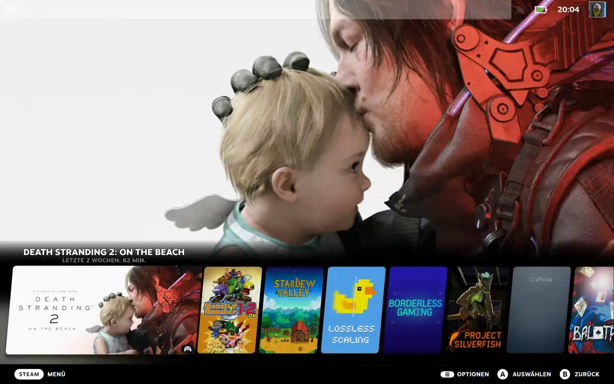

<p align="center">
  
</p>

WSGM reconstructs the SteamOS Game Mode experience on Windows 11 — on gaming handhelds, gaming PCs,
and DIY Steam Machines / living-room builds alike. It boots straight into Steam Big Picture and
gives you a controller- and touch-friendly quick access panel and taskbar on top of it.

**Explorer stays your Windows shell.** A small logon service starts WSGM when you sign in, covers
the booting desktop with a splash, waits until Windows has finished its sign-in work, and only then
hands the screen to Big Picture. Switching back to the desktop — and into game mode again — is one
press away at any time.

## Demo



## ⚠ Recovery — read this FIRST

Game mode ends Explorer while it runs, so if something goes wrong you can end up looking at a screen
with no desktop on it. **You can always recover:**

1. Press **Ctrl+Alt+Del** (this always works — it belongs to Windows, not to WSGM). On a handheld
   without a keyboard, attach a USB/Bluetooth keyboard.
2. Choose **Task Manager** → **Run new task**.
3. Type either:
   - `explorer.exe` — brings the desktop back for this session, or
   - `%LOCALAPPDATA%\WSGM\bin\WSGM.exe --restore-shell` — turns **off** game mode at sign-in and
     starts the desktop, so the next sign-in is an ordinary Windows one.

Three safety nets run on their own:

- **The takeover fails open.** If WSGM cannot end Explorer cleanly, it keeps the desktop, dismisses
  the splash and stays in desktop mode rather than leaving you on a black screen.
- **The service watches WSGM.** If WSGM exits with an error and no Explorer is running in your
  session, the service starts Explorer for you (once per sign-in, with your normal unelevated
  token).
- **The crash-loop breaker.** Three game-mode starts within two minutes and WSGM disarms itself:
  game mode at sign-in is switched off, Explorer is started if it is missing, and your display scale
  and Windows settings are put back.

## Why

I know there is Windows 11's FSE, but it has a very specific Problem. Windows 11's Xbox Full Screen
Experience does not deliver controller input to elevated processes.

Steam must run elevated if you want Steam Input to keep working while elevated windows have focus
(UIPI). That means if you want to update a Driver in the Device Manager for example, Steam's Desktop
Layout stops working the moment Device Manager is in focus. Older Games that need to run Elevated
also fail out on Steam Input as a Result. The last Issue was that if Steam was started Elevated
through Native FSE, it refused Controller Input from Virtual Controllers as made by Handheld
Companion or ClawTweaks. Which I can only attribute to some, excuse my language, UWP Style
Sandboxing Bullshit. Most likely the same shit that stops Steam Input from Working on XBOX Games.

WSGM gives you a fullscreen boot-to-Steam experience without FSE, so both things work at once.

## How it works

### Starting up

- A machine-wide Windows service (**WSGM Logon Service**) notices your sign-in and starts WSGM as
  you. When your account needs it — because Steam or one of your startup apps must run elevated — it
  starts WSGM already elevated, **without a UAC prompt**.
- The service only ever launches what your own per-user boot file (`%LOCALAPPDATA%\WSGM\boot.json`)
  tells it to, and only ever as you. Turning **Start game mode at sign-in** off in Settings is what
  disables it; nothing else about Windows is changed.
- WSGM shows its **boot splash** over the booting desktop, waits for Windows to finish its
  once-per-sign-in work (so autostart programs and the touch stack come up normally), then asks
  Explorer to exit the same way its own "Exit Explorer" command does — never a kill.
- Then it applies game-mode display settings, hosts its own tray so closed-to-tray apps keep their
  icons, launches your **startup apps** (each optionally elevated — e.g. Handheld Companion, with an
  optional delay before the first one and a stagger between them), and opens **Steam Big Picture**.
  Programs Windows already autostarted are not started twice.

### While you are in game mode

- **Quick access panel** — swipe in from the right screen edge, press the hotkey (default
  Ctrl+Alt+Home), use a recorded controller chord, tap the WSGM button on the taskbar, or let it
  open by itself when Steam exits. It docks to the right so the game stays visible, and is fully
  controller-navigable; LB/RB cycle its three tabs:
  - **Session** — start or focus Steam, switch to the desktop and back to game mode, exit Big
    Picture while staying in game mode (handy for adding a library), close Steam.
  - **Tools** — Settings, Task Manager, and the two launch-option helpers described under
    [Elevation and Steam Input](#elevation-and-steam-input).
  - **Power** — sleep, restart, shut down (the destructive ones ask twice).
- **Game-mode taskbar** — swipe up from the bottom edge. A full-width bar with the WSGM button on
  the left, your open windows in the middle (active app underlined, minimized apps dimmed), and tray
  icons, Wi-Fi and Bluetooth status, battery and a clock on the right. Both the window strip and the
  tray scroll, so neither can push the clock off a small screen.
- **Return to Desktop** exits Big Picture, pauses Steam monitoring and starts Explorer; **Back to
  Game Mode** ends Explorer again and brings Big Picture back, restarting Steam if it closed
  meanwhile. WSGM stays resident the whole time, and if a switch fails it keeps the desktop.

### Making it yours

- **Boot splash** — everything about it is configurable in **Settings → Appearance**: a title and an
  optional caption with their own colours and sizes, eleven spinner styles (or none), a background
  colour, background image and vignette, a logo, and independent placement for text, spinner and
  logo — anchored to any of nine screen positions with their own padding, or at exact coordinates.
  Presets fill everything in at once, a full-screen preview shows the result, and you can export
  your splash as a shareable `.wsgmsplash` file (images included) or import someone else's.
- **Accent colour** — pick any colour; the panel, taskbar, Settings and the volume indicator follow
  it immediately.

## Elevation and Steam Input

WSGM elevates itself when it has to — when Steam is already elevated or marked "run as
administrator", or when one of your startup apps needs it — and everything it starts inherits that.
That inheritance **is the point**: an elevated Steam is what lets Steam Input reach elevated windows
and the Steam overlay inject into elevated games, both of which Windows blocks for an unelevated
Steam. It is also what keeps WSGM's own edge swipes working while an elevated program has the focus.
When elevation is needed at sign-in, the logon service arranges it without a UAC prompt; if you
decline a prompt elsewhere, WSGM keeps running, but edge swipes stop working over elevated windows.

Elevation has two side effects, and WSGM ships a tool for each.

### Steam Input Lease — the controller in WSGM's own panels

Steam Input holds the controller continuously, so a panel that takes focus would normally get
nothing from the pad. Instead of fighting Steam for the device, WSGM **leases** it: while the quick
access panel or the taskbar is on screen, the running Steam client is asked to let go of the
controller, and it gets it straight back the moment the last panel closes. Steam sees what it would
see if you had briefly unplugged the pad.

- Your Steam Input configuration and layouts are **not** touched. Steam is not restarted, no driver
  is installed, nothing is hidden from Windows, and no Steam file on disk is modified.
- The lease lasts only as long as a panel is open — seconds, not the whole session.
- If WSGM ever crashes while holding one, Windows drops it by itself and Steam recovers; there is
  nothing to clean up.
- You can turn it off: **Settings → Quick access → Block Steam Input while panels are open**. With
  it off, Steam is left completely alone and the panels may only respond to touch while Steam's
  desktop layout holds the controller.

It works by injecting a small gate into `steam.exe` and hooking its controller calls, so
endpoint-security software may take an interest. The library lives in this repository under
`native/SteamInput` (MIT), and its blocking model was informed by SpecialK's ValvePlug.

**For a game that reads the controller itself** (bypassing Steam Input), block Steam Input for that
one title: quick access → **Tools → Copy Steam Input block command**, then paste into the game's
Steam launch options. The command looks like this — the `--` is required:

```
"%LOCALAPPDATA%\WSGM\bin\steam-input-lease.exe" -- %command%
```

The block lasts as long as that game runs, and the controller goes back to Steam when it exits.

### De-elevation — for games that refuse to run elevated

Because Steam runs elevated, so does everything it launches, and some games and emulators refuse to
start that way or misbehave. `WSGM.Deelevate.exe` relaunches one title at normal integrity while
everything else stays as it is. Quick access → **Tools → Copy de-elevation command**, then paste
into that game's launch options — note there is **no** `--` here:

```
"%LOCALAPPDATA%\WSGM\bin\WSGM.Deelevate.exe" %command%
```

It passes Steam's own arguments, working directory and environment through unchanged (Steam's
`SteamAppId` lives in there, so the game still sees Steam properly), stays alive for as long as the
game does, reports the game's real exit code back to Steam, and stops the whole game tree if Steam
terminates it — so nothing is left running behind Steam's back. It logs separately to
`%LOCALAPPDATA%\WSGM\deelevate.log`.

## Install

**Prerequisite: Steam.** WSGM is Steam-exclusive and the setup refuses to install when Steam is
missing — install Steam, sign in once, then run the setup. Everything else is self-contained (native
binary: no .NET runtime, no VC++ redistributable). **Windows 11 x64** is required and enforced by
the setup (the theoretical API floor is 64-bit Windows 10 1607+, but only Windows 11 is tested and
supported; details in the wiki).

Download and run **`WSGM-Setup-<version>.exe`**. The setup asks for **administrator rights** — it
registers the machine-wide logon service. WSGM itself still lives per-user in
`%LOCALAPPDATA%\WSGM\bin`; only the service binary goes to `Program Files\WSGM`. You get a Start
Menu entry and an entry in Settings → Apps.

The installer already registers the service and writes your boot file, so the normal path is:

1. Open WSGM — Steam is detected automatically. Add startup apps from the suggestions (Handheld
   Companion and friends are detected too).
2. Leave **Start game mode at sign-in** on (it is on by default), and **Save changes**.
3. Sign out, sign back in.

Upgrading: just run the newer setup. It stops the service and any running WSGM first, then restarts
WSGM afterwards in the mode it was in.

Uninstall: Windows Settings → Apps → WSGM. The uninstaller stops and removes the logon service, puts
machine settings it changed (UAC prompt behaviour, lock-on-wake, display scale) back from their
snapshots, and only then removes its files from `%LOCALAPPDATA%\WSGM`, `Program Files\WSGM` and
`ProgramData\WSGM`.

Building a release yourself: `.\build.ps1` (needs the .NET 9 SDK, VS C++ build tools, a Rust
toolchain and Inno Setup 6) → `publish\WSGM-Setup-<version>.exe`.

For development validation, run `./eng/verify.ps1`. It checks Prettier and C# formatting, lints and
builds the solution, runs unit tests, and writes Cobertura/LCOV coverage to `TestResults`. Run
`./eng/verify.ps1 -Fix` to apply formatter fixes first. The safe manual UI checks are `--settings`
and `--overlay-test`; never automate game mode.

## Command line

`WSGM.exe`:

| Flag                                                | Effect                                                                                                      |
| --------------------------------------------------- | ----------------------------------------------------------------------------------------------------------- |
| _(none)_                                            | Settings window (portable copies show the welcome dialog first)                                             |
| `--boot`                                            | Game-mode boot takeover — what the logon service starts at sign-in                                          |
| `--shell`                                           | Force game mode without the boot takeover                                                                   |
| `--settings`                                        | Force the settings window                                                                                   |
| `--overlay-test`                                    | Show the panel and taskbar without starting anything else (development/testing)                             |
| `--restore-shell`                                   | Recovery: turn off game mode at sign-in, start Explorer, exit (needs no working GUI)                        |
| `--install`                                         | Headless: install/update app files only                                                                     |
| `--setup`                                           | Headless: install app files, migrate off any legacy shell registration, write the boot file                 |
| `--uninstall-app`                                   | Headless: restore machine settings, remove shortcut/registration/files                                      |
| `--uninstall-restore`                               | Restore machine settings (display scale, UAC, lock-on-wake) from their snapshots (used by the uninstaller)  |
| `--unregister-shell`                                | Quiet restore of a legacy shell registration — no Explorer start, no UI (used by the uninstaller)           |
| `--set-uac-silent` / `--restore-uac`                | Elevated one-shot: silence/restore the UAC prompt for admins (WSGM relaunches itself elevated to run these) |
| `--disable-lock-on-wake` / `--restore-lock-on-wake` | Elevated one-shot: disable/restore the sign-in requirement on wake                                          |

`WSGM.LogonService.exe` (installed to `Program Files\WSGM`, normally driven by the setup):

| Flag          | Effect                                                               |
| ------------- | -------------------------------------------------------------------- |
| `--install`   | Create or reconfigure the WSGM Logon Service and start it (elevated) |
| `--uninstall` | Stop and delete the service (elevated)                               |

WSGM logs to `%LOCALAPPDATA%\WSGM\wsgm.log`; the service logs to
`%ProgramData%\WSGM\wsgm-service.log`.

## AI usage disclaimer

Large parts of WSGM are written with AI assistance, directed and reviewed by a human. Changes are
tested on real handheld hardware before release.

## License

MIT. Controller button glyphs from CC0 prompt packs (see `src/WSGM/Assets/Glyphs/CREDITS.md`).
