

  

WSGM rebuilds the SteamOS Game Mode experience on Windows 11, on gaming handhelds, gaming PCs and
DIY Steam Machines. You sign in, you land in Steam Big Picture, you drive everything with the pad
and the touchscreen, and you only see the desktop when you ask for it. Explorer stays your Windows
shell the whole time.

> [!IMPORTANT]
>
> Game Mode ends Explorer while it runs. If you are ever left without a desktop, **Ctrl+Alt+Del**
> always gets it back. See [Recovery](#recovery-read-this-first) before your first boot.

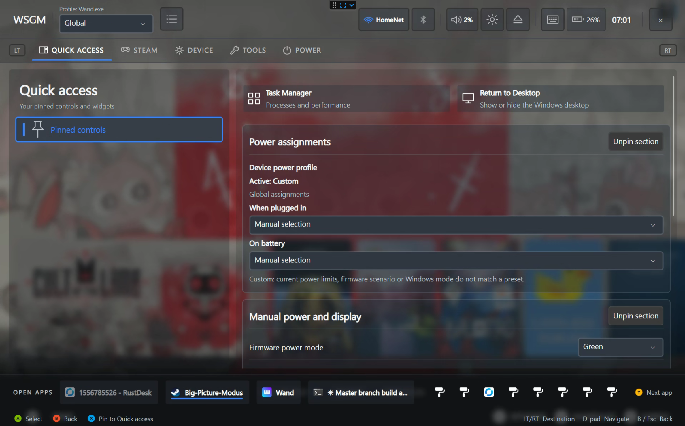

## The overlay

One fullscreen sheet slides down from the top edge over whatever is running, with live glass behind
it and an opaque fallback. It is built for the pad and the touchscreen: LT and RT switch between
Quick access, Steam, Device, Tools and Power, each with its sections on the left and their controls
beside them. X pins any control or whole section to the Quick access home, next to plugin widgets
and your own actions.

The header is the status bar and the utility tray: Wi-Fi, Bluetooth, volume, brightness, Safe Eject
for SD cards and USB drives, the on-screen keyboard, battery and the clock. Each opens its own panel
inside the sheet, so you can join a network, pair a controller or headset, or switch the audio
output without Windows' flyouts, which cannot open in Game Mode. The profile selector beside the
WSGM logo shows which game is running and switches between its own profile and Global. Open programs
and tray icons stay in the bottom rail, and Y cycles through them. The left and right edge gestures
open Steam's own menus, and hardware volume keys get an on-screen indicator.

  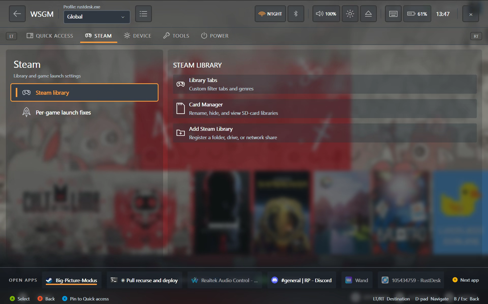
  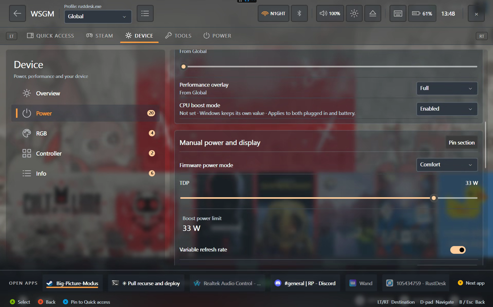

The **Device** tab combines Windows and device controls on shared Power, RGB, Controller and Info
pages: firmware power mode, TDP and boost limit, variable refresh, CPU boost, Windows power schemes,
and AC and battery power assignments, both as Global defaults and as per-game overrides. A value a
game profile does not set reads **From Global**, so changing Global still reaches that game.
**Tools** and **Power** carry resolution and refresh rate, the Intel P-core and E-core preference, a
manual keep-awake, muting while the screen is off during downloads, display-off timeouts, and a
report of what woke the machine from standby. **Steam** holds the library tools and per-game launch
fixes described below.

## Steam's own menus, working

  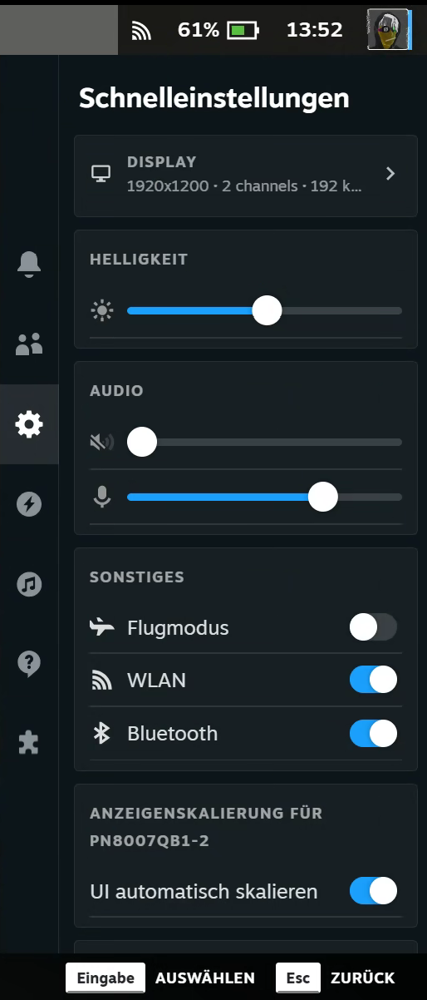
  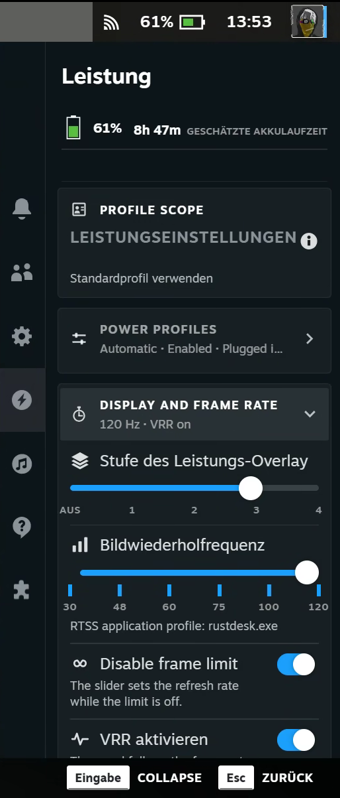
  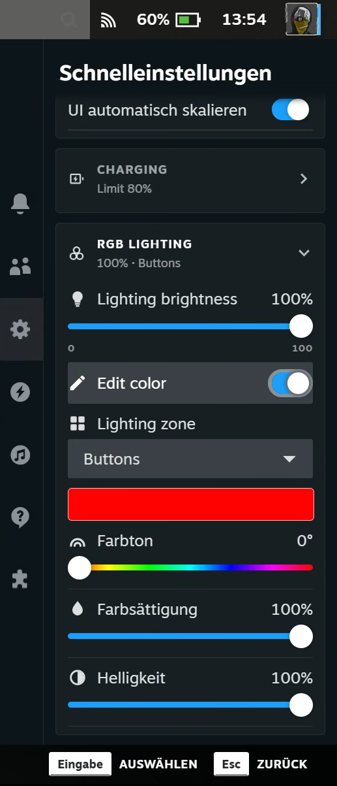

Steam ships its Performance, audio, Bluetooth and network menus on Windows with nothing behind them.
WSGM answers them, so brightness, volume, Wi-Fi and Bluetooth work inside Steam's own Quick Access
Menu the way they do on a Steam Deck, and Big Picture's header shows your real network and signal
strength.

WSGM adds its own sections in Steam's style. Quick Settings gets Display (resolution, refresh, audio
format) ahead of Valve's controls, and Charging and RGB lighting after them. Performance gets the
profile scope, device power profiles, display and frame rate, sustained (PL1) and boost (PL2) power
limits, the controller and a reset. Each section folds away and its heading tells you what it holds.
The screenshots here are from an MSI Claw 8 AI+ A2VM with Steam set to German.

  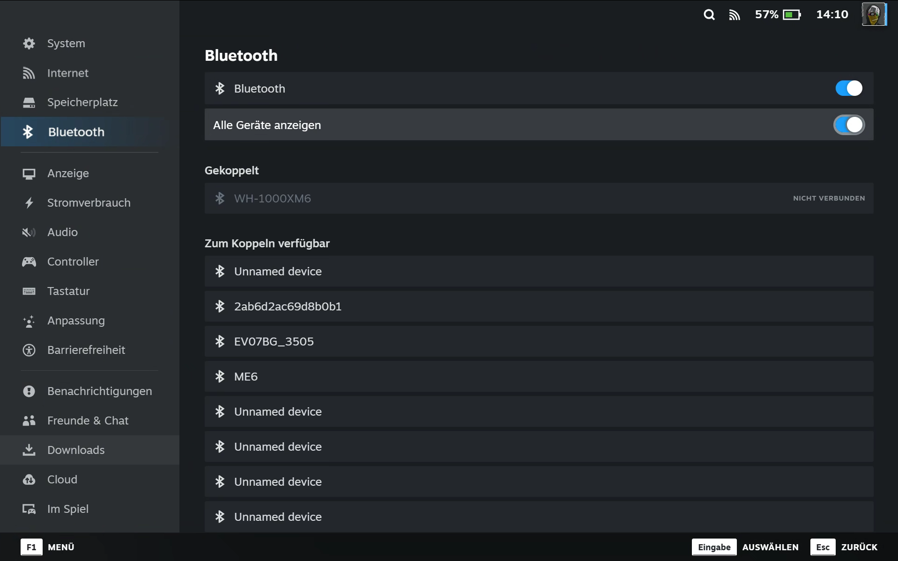
  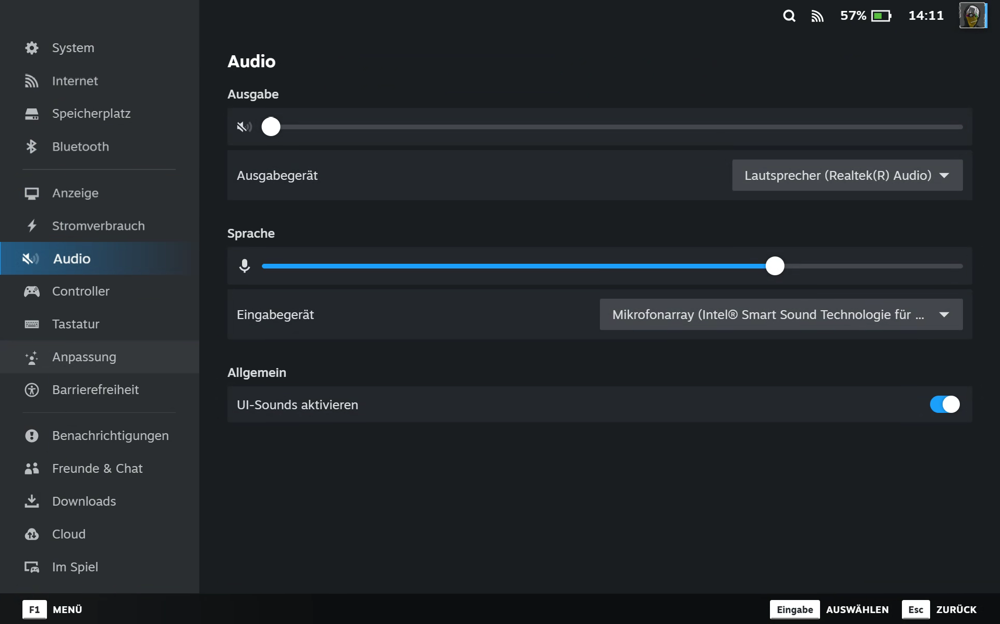

The same goes for Steam's Settings pages. Bluetooth pairs and connects devices, Audio sets the
output and input devices and their levels, and Storage and Screensaver get backends too.

**Frame limit, OSD and AutoTDP** run through your own RivaTuner Statistics Server install: a frame
limit paired with the refresh rates your display actually accepts, on-screen display levels, and an
AutoTDP that steers the power limit from measured frametimes.

**Device power profiles** come from the device plugin as a TDP, firmware scenario and Windows mode
preset, chosen from the Device page or Steam's Performance tab. The Claw offers Super Battery,
Balanced, Extreme Performance and Full Power. Changing something by hand saves a Custom profile for
whichever source you are on, AC or battery, and switching back restores it.

## WSGM inside Steam

  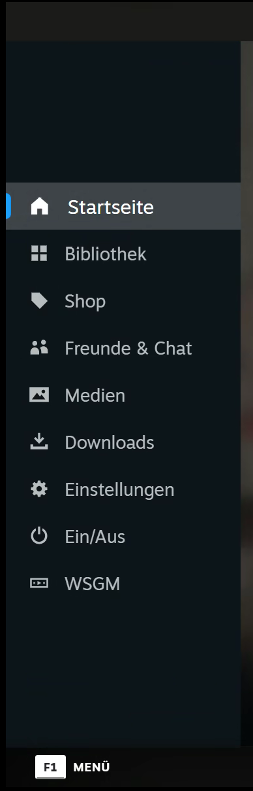
  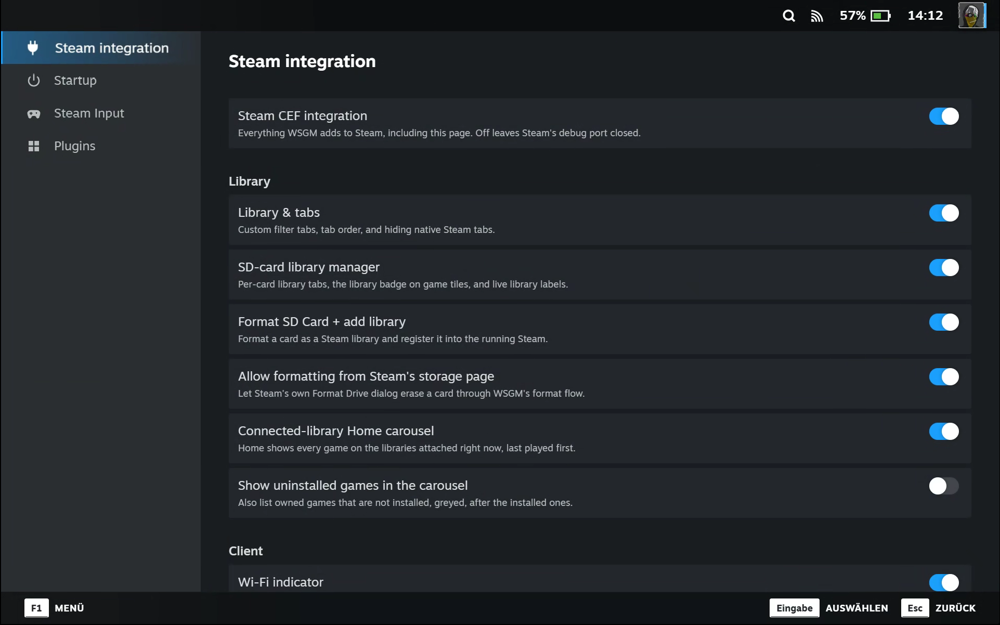
  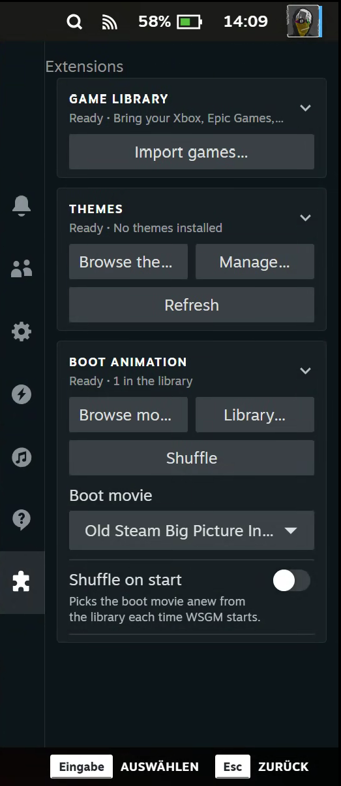

Big Picture's main menu has a WSGM row just above Power. It opens WSGM's own settings in Steam's
Settings layout: which Steam features WSGM adds, how it starts, Steam Input, and each installed
plugin's settings. The Quick Access Extensions tab holds the Game Library, Themes and Boot
animation, each one press away from a game.

## Game Library

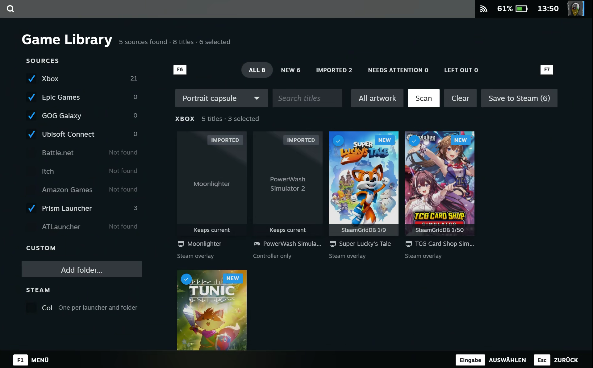

WSGM's own Steam ROM Manager, in both the overlay and Steam's Quick Access Extensions tab. It finds
the games Xbox, Epic Games, GOG Galaxy, Ubisoft Connect, Battle.net, itch, Amazon Games, Prism
Launcher and ATLauncher installed, plus any folder of shortcuts you point it at, shows them as a
poster grid and brings them into Steam with artwork you pick before saving: per title, or for every
title at once, from the launcher's own images, SteamGridDB or Screenscraper.

Windows starts a packaged Xbox game outside Steam's launch tree, so a plain shortcut would get you
no overlay and no Steam Input; WSGM ships a launcher that puts them back. A title the Store reports
as multiplayer defaults to a controller-only route that injects nothing, and moving it to the
overlay route means accepting the ban risk yourself. This is experimental and no anti-cheat has been
tested against it. See [the Game Library](docs/game-library.md).

## Themes and boot movies

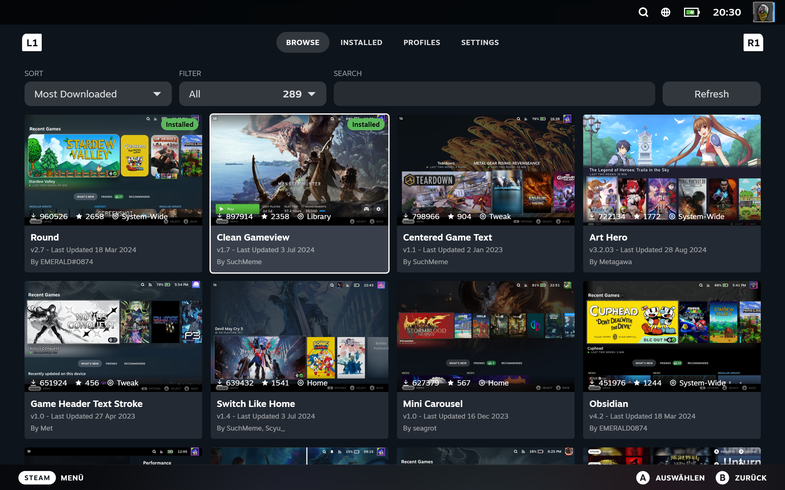

Browse DeckThemes, the CSS Loader store, from a native Steam page or the overlay, install a theme
with everything it needs, switch it on from the Extensions tab and set its patches and colours
there. Themes written for CSS Loader work as they are, with their profiles, dependencies and the
class-name translations DeckThemes publishes for each Steam build, and a themes folder copied from a
Deck keeps which themes were on.

**Boot movies** come from [SteamDeckRepo](https://steamdeckrepo.com), the collection Animation
Changer browses on the Deck. Keep the ones you like in WSGM's library, pick the one Steam plays when
Big Picture starts, or let WSGM shuffle a new one at every start.

## More in Steam

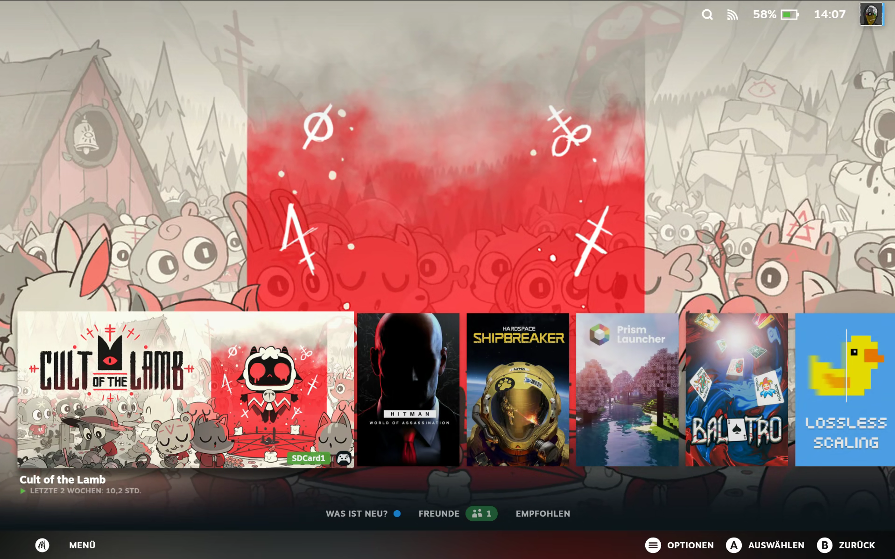

**SD card and external drive libraries.** Every removable Steam library gets its own tab that
remembers its games while the card is out. Rename, hide or forget cards from the Card Manager, and a
badge on every library tile and game page names the library a game is on, green while it is
installed. Big Picture Home's carousel lists every game on the libraries attached right now, last
played first, and drops a card's games when the card comes out.

**Library tabs.** Build custom tabs for Steam's library from filters (installed, tags, playtime,
size, title patterns and so on), reorder the whole tab strip, and hide Steam's built-in tabs.

**Drive formatting.** Turn a card or drive into a ready-to-use Steam library in one guided flow,
keeping its exact drive letter, from the overlay or from Steam's own Storage page. You can also
register any folder or network share with the running Steam client, no restart needed.

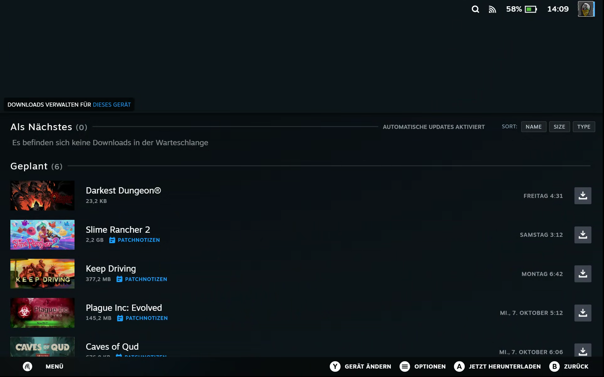

**Download sorting.** Name, Size and Type buttons on Big Picture's download queue reorder everything
waiting to download in one press, and the pad reaches them like any other Steam control.

**Artwork for any game**, non-Steam shortcuts included. Search SteamGridDB and Screenscraper.fr for
capsules, heroes, logos and icons from a native Steam page, opened from the cog menu on a game's own
page.

**Per-game launch fixes, applied for you.** Open the panel on a game and pick the fix; WSGM writes
it straight into the running Steam client. No pasting, no restart, and it gets the awkward non-Steam
shortcut setup right by itself. One button puts everything back.

## Controllers and Steam Input

**Steam Input everywhere.** WSGM starts Steam itself, elevated, so Steam Input keeps working over
elevated windows and games. Windows' own Steam startup entries would undo that, so setup asks to
take them over. Nothing is deleted, and uninstall puts back exactly what WSGM changed.

**The Steam Input Lease** is the first tool that takes the controller out of the running Steam
client's hands _while it runs_. Steam is asked to let go of the pad and gets it back the moment it
needs it again: no restart, no drivers, no config changes and no Steam file touched. Steam just sees
a brief unplug. This is what lets WSGM's own panels read the controller while they are open.

**Free the controller for emulators and SDL3 apps.** Steam's desktop layout normally swallows the
pad from every other program. The lease blocks Steam Input for one title, so emulators and SDL3
applications read the real controller directly, and Steam takes it back the moment the game exits.
The same wrapper de-elevates titles that refuse to run elevated, and it can do both at once.

## Devices and plugins

**Device plugins.** One MIT-licensed Device SDK, one installed package at a time, picked by setup
from your hardware. The MSI Claw package is the reference, hardware-tested on the Claw 8 AI+ A2VM
and covering every Claw: power and charge limits, fan behaviour, RGB lighting, the controller and
its motion sensors, OEM buttons that open Steam's menus, variable refresh, Intel graphics settings,
and a virtual controller. A package for the four ROG Ally models is built and waiting for its
hardware pass. You can write one for another handheld with
[Device Lab](src/WSGM.DeviceLab/README.md) and the
[authoring guide](docs/device-plugin-authoring.md).

**Common plugins** are packages beyond the device slot, each one explicitly enabled. The first is an
IR plugin for the XIAO IR Mate that learns and sends remote codes over USB or Wi-Fi and can drive an
HDMI switch or TV as part of entering Game Mode. It is still under development, see its
[README](src/WSGM.Plugin.Ir/README.md).

## Game Mode and Desktop Mode

A logon service starts WSGM at sign-in. Starting with Windows and taking the screen over are two
separate choices: Settings > System has **Start WSGM at sign-in** and **Start in** (Game or
Desktop). The install mode seeds them and Quick Setup confirms them on first run.

**Game Mode** ends Explorer and lands in Big Picture behind a boot splash you can make your own
(text, spinner, logo, background, shareable presets), with an accent colour every surface follows.
**Desktop Mode** is a complete resident session with Explorer as the shell, for gaming PCs and Steam
Machines: plugins, overlay, hotkey, controller chord and performance services all run, WSGM starts
the windowed Steam client itself and keeps it running, and Game Mode is one press away from the
notification icon or the overlay. The icon also opens Settings and offers Exit WSGM. Start WSGM
again from the Start Menu; launching it while it is already running just opens the existing session.
Setup also offers an optional Desktop shortcut.

**WSGM Settings** has its own Start Menu shortcut, and its own Desktop shortcut when you pick
Desktop shortcuts. It opens Settings in the running resident session and shares its controller input
owner. With no resident session it opens standalone Settings without starting one.

**Display layouts.** Settings > Display configures what entering Game Mode does. Default drops every
display to 100% scaling so DPI-unaware games render 1:1. Custom applies a saved layout, optionally
after waiting for a display and running plugin actions like switching an HDMI input. Game Mode and
Desktop layouts are edited independently: drag screens around, choose a primary display, and set
resolution, refresh rate, scaling, HDR and exact positions. Copying the current desktop is optional,
refreshing the display list preserves unfinished edits, and Undo reverses the last one. Remembered
displays stay editable while unplugged. Saving applies the layout on the next mode switch.

Plugin actions can also run when leaving Game Mode and at desktop startup and wake, which is how
external HDMI and input routing works without putting device protocols inside WSGM. The wait for a
display has no time limit, because a TV behind an HDMI switch only appears once the switch selects
this PC. Entering Game Mode is one cancellable transaction: until Explorer leaves, Cancel on the
splash puts the desktop back exactly as it was.

See [session automation](docs/plugin-system.md#session-automation) and
[Game Mode display layouts](docs/power-and-display.md#game-mode-display-layouts).

## Recovery, read this first

Game Mode ends Explorer while it runs, so if something goes wrong you can end up looking at a screen
with no desktop on it. **You can always get it back:**

1. Press **Ctrl+Alt+Del**. This always works, because it belongs to Windows and not to WSGM. On a
   handheld with no keyboard, plug in a USB or Bluetooth one.
2. Choose **Task Manager**, then **Run new task**.
3. Type one of:
   - `explorer.exe` to bring the desktop back for this session, or
   - `"%ProgramFiles%\WSGM\App\WSGM.exe" --restore-shell` to turn the sign-in start **off** and
     start the desktop, so the next sign-in is an ordinary Windows one.

WSGM fails open, and its safety nets run by themselves. The boot takeover keeps the desktop if it
cannot end Explorer cleanly, the service starts Explorer if WSGM crashes without one, and three
failed Game Mode starts within two minutes disarm Game Mode automatically.

## Why not Windows' own fullscreen experience?

Windows 11's Xbox Full Screen Experience does not deliver controller input to elevated processes,
and Steam has to run elevated if you want Steam Input to keep working while an elevated window has
focus, or in games that require elevation. Under FSE, an elevated Steam also refuses input from
virtual controllers, which breaks Handheld Companion and anything like it. WSGM gives you
boot-to-Steam without FSE, so all of it works at the same time.

## Compatibility

**Handheld Companion** works, and gets heavy use on WSGM's own development devices. Tested against
all of its controller types.

**CSSLoader Desktop** works beside WSGM's own themes, since neither touches the other's nodes, with
one caveat either way: themes restyle the same Steam UI that WSGM's library-tab engine patches, so a
theme that touches the library's tab strip can break the injected tabs.

**Non-Steam shortcuts are set up differently.** WSGM handles this for you, but it is worth knowing
why the two look different in Steam. A normal Steam title takes the wrapper in its **Launch
Options** (`"…\WSGM.Launch.exe" --deelevate -- %command%`). A non-Steam shortcut cannot: Steam
quietly ignores an exe-replacement launch option there and runs the original target anyway, mangling
the command line in the process, so the wrapper never starts. For a shortcut, the wrapper goes in
the **Target** field and the real program moves into **Launch Arguments**. With the Steam
integration turned off, the Tools tab copies the command for you to apply by hand, and then the
shortcut layout is on you.

## How it works

The full technical write-up lives in the wiki:
**[How it Works](https://github.com/KillerPixelCrew/WSGM/wiki/How-it-Works)**. It covers the logon
service, the Explorer takeover, Desktop Mode, the Steam Input Lease, the Steam CEF bridge behind the
library features, device plugins, elevation and recovery. The in-repo [docs](docs/README.md) carry
the exact log lines, budgets and dates it summarizes.

## Install

**You need** Steam (installed and signed in at least once, setup refuses to run without it) and
**Windows 11 x64**. Everything else is self-contained: no .NET runtime, no redistributables.

1. Download and run **`WSGM-Setup-<version>.exe`** from the
   [latest release](https://github.com/KillerPixelCrew/WSGM/releases/latest). It asks for
   administrator rights once. Keyboard, touch and a gamepad all work. It needs no network, except to
   download RivaTuner Statistics Server when you want it and it is not installed yet.
2. Setup checks your hardware. When a bundled device plugin matches it, setup says so and installs
   that plugin, plus the virtual controller (VIIPER, the USB/IP driver and HidHide) when the plugin
   needs it; the driver step restarts USB and asks for a reboot. With no match you get plain WSGM.
   Then pick:
   - **Full** or **Minimal**: every integration on, or the WSGM session only.
   - **Steam first** boots into Game Mode; **Desktop first** starts WSGM with Windows and waits in
     the notification area, with Game Mode one press away.
   - **Customize** switches each integration on or off, including taking over how Steam starts.

   Everything setup asks is a normal setting afterwards, and running setup again to repair or update
   never changes what you set.

3. Open WSGM. Steam is detected automatically, and you can add startup apps from the suggestions,
   which detect Handheld Companion and friends too. Every first-run choice was already asked by
   setup, including taking over the Run entries, Startup shortcuts or scheduled tasks Windows uses
   to start Steam; WSGM Settings changes any of them later.

**Upgrading:** WSGM checks for a new release once a day and offers it in Settings > System, or run
the newer setup yourself. **Uninstalling:** Windows Settings > Apps > WSGM. It restores every
machine setting it changed, always shows your controller to games again, and removes its files. It
keeps your settings unless you untick that, and can leave USB/IP or HidHide installed.

Building from source: `.\build.ps1` (needs the .NET SDK, Node.js with npm, Rust with the MSVC
toolchain, Visual Studio with the C++ workload, CMake, Go, Git and a cgo-capable GCC), which
produces `publish\WSGM-Setup-<version>.exe`.

## Credits

[Brochacho](https://github.com/BrochachoTheBro) is WSGM's main tester and donated the ROG Xbox Ally
X that the Device Lab runs on. Every release is tried on that machine before it ships.

The library features are Windows reimplementations of approaches from Decky Loader plugins on
SteamOS: [TabMaster](https://github.com/Tormak9970/TabMaster) for filter tabs and tab-strip control,
[MicroSDeck](https://github.com/CEbbinghaus/MicroSDeck) for per-card libraries, and
[decky-steamgriddb](https://github.com/SteamGridDB/decky-steamgriddb) for the artwork flow. Themes
come from [DeckThemes](https://deckthemes.com), the store behind CSS Loader, and boot movies from
[SteamDeckRepo](https://steamdeckrepo.com). The Steam Input Lease's blocking model was informed by
SpecialK's ValvePlug. Controller button glyphs come from CC0 prompt packs, see
`src/WSGM/Assets/Glyphs/CREDITS.md`.

## AI usage disclaimer

Large parts of WSGM are written with AI assistance, directed and reviewed by a human. Changes are
tested on real handheld hardware before release.

## License

Copyright (C) 2026 NightHammer1000.

WSGM is free software: you can redistribute it and/or modify it under the terms of the **GNU General
Public License as published by the Free Software Foundation, either version 3 of the License, or (at
your option) any later version** ([full text](LICENSE)).

WSGM is distributed in the hope that it will be useful, but WITHOUT ANY WARRANTY; without even the
implied warranty of MERCHANTABILITY or FITNESS FOR A PARTICULAR PURPOSE. See the GNU General Public
License for more details.

The Plugin SDK, Device SDK, Claw reference plugin, ROG Ally plugin and Handheld Companion scaffold,
including their test projects, keep their MIT licenses under `src` and `tests`, so external packages
can implement the contracts. Device Lab compiles WSGM's own interop sources and is GPL-3.0-or-later
like WSGM. See [device plugin authoring](docs/device-plugin-authoring.md) for paths and build
commands.

Bundled third-party components keep their own licenses; their notices ship beside the executable and
with the installer.
