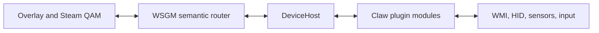

# MSI Claw 8 AI+ A2VM Device Plugin Plan

Status: implementation-ready design, hardware validation still required  
Target branch: `2.0`  
Parent plan: [`2.0-design.md`](./2.0-design.md)  
Reference device: MSI Claw 8 AI+ A2VM, board `MS-1T52`  
Research snapshot: 2026-08-26

## Purpose

This document defines the first complete WSGM 2.0 device plugin. It covers detection, ownership, power, fans, lighting, the physical controller, rumble, motion sensors, rear buttons, front OEM buttons, and the MSI firmware-generated `Win+G` shortcut on the right Quick Settings button.

Handheld Companion is a behavioral and protocol reference, not the architecture to reproduce. Where possible, its findings have been checked against the accepted Linux `hid-msi` driver series, HHD, the Linux `msi-wmi-platform` work, ClawTweaks, and MSI's published device specification. Conflicts are called out instead of being silently resolved in favor of one implementation.

Device ownership follows the WSGM process lifetime, not the current shell mode. When integration is enabled, the plugin starts asynchronously with WSGM and remains active across Desktop Mode, Game Mode, games, and transitions between them. The WSGM overlay is the complete device-control surface in both Desktop and Game Mode; Steam's native QAM is an additional Game Mode surface.

Asynchronous initialization means only that hardware work does not block WSGM startup, its UI, or a Desktop/Game Mode transition. It does not mean initialization is deferred until Game Mode. If WSGM is launched on the desktop, the Claw is detected and controllable there immediately as each capability becomes ready.

## Locked product decisions

- The plugin targets the Claw 8 AI+ A2VM board `MS-1T52`. It must not use the Claw A1M's limits or firmware offsets.
- Device integration is optional. When it is disabled, no Claw host, hook, sensor subscription, WMI watcher, HID handle, firmware write, virtual controller, or HidHide change remains active.
- When device integration is enabled, its lifecycle spans the entire WSGM run. Entering or leaving Game Mode does not activate, deactivate, reset, or hand off the device.
- The device lifecycle has exactly two terminal triggers: WSGM exits, or the user turns Device Integration off in Settings during the run.
- The Steam Input lease subsystem remains a permanent WSGM capability. Managed device input changes when surface leases are acquired; it does not remove the lease implementation.
- Controller management is independently optional beneath device integration. This permits WSGM hardware control with Handheld Companion or another application owning controller emulation.
- HIDMaestro remains the WSGM virtual-controller backend. The Claw plugin emits canonical input and consumes canonical output; it never talks to HIDMaestro directly.
- Initial virtual targets are Steam Deck Composite, Xbox 360, and DualShock 4.
- There is no general input mapper and no gyro-to-mouse or gyro-to-stick mapping. Only OEM controls may be reassigned.
- Every user-facing device control lives in the WSGM overlay. Settings contains only WSGM ownership and startup configuration.
- The right-front Quick Settings button opens Steam's native QAM by default.
- While the Claw plugin owns OEM-button capture and suppression, it blocks the confirmed firmware `Win+G` side effect without disabling `i8042prt`, the ACPI keyboard device, or the volume keys; WSGM maps the resulting logical control to QAM.
- MSI WMI and the controller's vendor HID protocol are the A2VM transports. PawnIO/direct EC access is not needed for this plugin unless future hardware evidence proves otherwise.
- The Claw plugin owns every MSI WMI, vendor HID, power, fan, lighting, controller, motion, rumble, OEM-input, validation, rollback, and recovery implementation. WSGM exposes semantic capabilities and UI but no Claw hardware backend.
- The exact `MS-1T52` definition composes reusable MSI implementation modules; it never inherits another Claw model's limits or firmware policy.
- Unknown board IDs, unknown controller firmware, failed prerequisite reads, and ownership conflicts degrade capabilities; they never trigger guessed hardware writes.

## Scope and non-goals

### In scope

- Exact device and firmware detection.
- Serialized MSI WMI access for sustained and short power limits, fan tables, fan mode, fan speed, and relevant telemetry.
- Serialized vendor HID access for controller mode, configuration/profile reads, lighting, and verified output reports.
- DirectInput/XInput physical input acquisition.
- M1 and M2 rear-button acquisition.
- Physical dual-motor rumble.
- Windows motion-sensor acquisition, orientation correction, and calibration.
- WMI front-button events and firmware keyboard-chord suppression.
- Overlay controls, native Steam QAM integration, profiles, diagnostics, lifecycle recovery, and clean external-manager handoff.

### Explicitly out of scope

- Face-button, stick, trigger, or D-pad remapping.
- Gyro-to-mouse, gyro-to-stick, or touch-to-mouse conversion.
- Inventing touchpads or stick-touch sensors that the Claw does not have.
- Arbitrary keyboard macros, executable actions, or scripts in OEM-button assignments.
- Disabling the PS/2/i8042 service.
- Killing MSI Center M, Handheld Companion, or their services automatically.
- A new unsigned kernel input filter for the first release.
- Direct EC register experimentation on users' devices.
- Repeated firmware/EEPROM writes during startup, preview, polling, or every lighting frame.

## Evidence and confidence model

Implementation work uses the evidence lifecycle defined by Device Lab:

| State | Meaning | Write policy |
| --- | --- | --- |
| Candidate | Suggested by a reference, similarity match, schema, or one observation | No generated or runtime write |
| Correlated | Repeatedly associated with the expected action but not yet causally proven | No generated or runtime write |
| Corroborated | Supported by repeated A/B/revert evidence or independent sources | Eligible only for an explicit bounded compatibility trial |
| Hardware verified | Reproduced on the exact target by a reviewed bounded Device Lab trial or the Claw plugin, with readback and verified restoration | Eligible for implementation and acceptance testing |
| Retail approved | Reviewed against supported firmware, lifecycle, failure, and safety gates | May ship |
| Rejected | Disproven, unsafe, incompatible, or superseded | Must not be selected |

Provenance is recorded separately from evidence state: official documentation, independently captured hardware evidence, another open-source implementation, HC behavioral reference, or inference. A mature reference does not automatically make a claim hardware verified on `MS-1T52`.

The first hardware bring-up records the user's exact SMBIOS data, controller `bcdDevice`, HID descriptors, report descriptors, PnP/container IDs, MSI WMI provider version, BIOS/EC/controller firmware versions, motion-sensor identity, WMI event timing, and current hardware state. That capture becomes the first golden fixture for the plugin.

## Device identity and activation gate

The activation gate is intentionally narrower than a generic MSI VID check.

| Signal | Required value |
| --- | --- |
| SMBIOS manufacturer | Normalized/case-insensitive `Micro-Star International Co., Ltd.` |
| SMBIOS product/board | `MS-1T52` |
| Marketing name | MSI Claw 8 AI+ A2VM/A2VMX |
| Controller vendor ID | `0x0DB0` |
| Normal controller product IDs | `0x1901` XInput or `0x1902` DirectInput |
| Additional observed IDs | `0x1903` and `0x1904`, diagnostics only until mode semantics are confirmed |
| WMI scope | `root\\WMI` |
| MSI ACPI provider | Enumerated `MSI_ACPI` instance validated against the board/provider version; HC commonly observes `ACPI\\PNP0C14\\0_0` |

`MS-1T42` is the 7-inch Claw A2VM and `MS-1T41` is the A1M. They require separate plugin descriptors even when a transport is shared. In particular, the A1M's larger power limits must never leak into the `MS-1T52` descriptor.

The exact board match activates device discovery even if the controller is disabled, offline, or re-enumerating. Each capability has its own secondary gate:

- Power and fan control require a responsive MSI WMI provider and successful snapshot reads.
- Lighting and firmware-profile operations require an exact controller-firmware descriptor.
- Controller ownership requires a known controller mode and a successful re-enumeration test.
- Motion requires a stable Windows sensor identity.
- Front OEM actions require captured MSI WMI events. The firmware chord may be suppressed, but its low-level-hook observation is not trusted as an action source because the hook cannot identify the originating keyboard.

An unknown `bcdDevice` may still allow ordinary gamepad input and read-only diagnostics. It must not select the "nearest" RGB or profile-memory address.

## Proposed plugin manifest

The exact 2.0 package schema remains a core-platform decision, but the Claw package should be expressible without code outside the device package. A proposed declarative portion is:

```json
{
  "id": "wsgm.device.msi.claw-8-a2vm",
  "apiVersion": 1,
  "displayName": "MSI Claw 8 AI+ A2VM",
  "devices": [
    {
      "smbiosManufacturer": "MICRO-STAR INTERNATIONAL CO., LTD.",
      "smbiosProducts": ["MS-1T52"],
      "usb": [{ "vid": "0DB0", "pids": ["1901", "1902", "1903", "1904"] }]
    }
  ],
  "resources": [
    { "id": "msi-acpi", "kind": "wmi", "access": "read-write" },
    { "id": "claw-mcu", "kind": "hid", "access": "read-write" },
    { "id": "physical-controller", "kind": "controller", "access": "exclusive-when-managed" },
    { "id": "motion", "kind": "windows-sensor", "access": "read" },
    { "id": "oem-chord", "kind": "interactive-keyboard-hook", "access": "suppress" }
  ],
  "riskDeclarations": [
    "hardware-power-writes",
    "custom-fan-control",
    "controller-reenumeration",
    "device-persistent-lighting-possible",
    "global-keyboard-suppression"
  ],
  "dependencies": [{ "id": "msi-wmi-provider", "kind": "oem-installed", "required": true }],
  "implementationModules": [
    { "id": "MsiWmiPlatform", "version": 1 },
    { "id": "MsiClawMcu", "version": 2 },
    { "id": "MsiClawA2VmPowerPolicy", "version": 1 }
  ],
  "capabilities": [
    "power-limits",
    "dual-fan-curves",
    "rgb",
    "physical-controller",
    "rumble",
    "motion",
    "oem-buttons"
  ]
}
```

The manifest is auditable metadata, not authorization by assertion. Resource and risk declarations describe what the package intends to use; they cannot constrain direct user-mode access by arbitrary plugin code. WSGM verifies package trust and declarative install-time prerequisite metadata before activation. The Claw plugin authoritatively probes the MSI provider and runtime dependency health during activation and reports per-capability availability. No privileged helper is declared unless hardware testing proves one necessary and that exact Claw-specific component receives a separate review.

## Runtime architecture

WSGM's main executable remains NativeAOT. The Claw integration needs dynamic community plugins, `System.Management`/WMI, WinRT sensors, and an interactive keyboard hook, so the plugin does not load into the main process.



### Process boundary

`WSGM.DeviceHost.exe` is a JIT-capable, unelevated, per-user, per-interactive-session sidecar. Each plugin package runs in its own host process and receives no WSGM secrets, unrelated handles, or privilege-bearing client. The host loads the Claw package; the plugin owns WMI, HID, WinRT sensors, the interactive hook, every hardware state machine, and its recovery journal.

Process separation provides crash and dependency isolation. It is not described as a security sandbox.

The sidecar starts during WSGM startup when device integration is enabled and stays alive until WSGM exits or the user turns Device Integration off in Settings. Steam/Big Picture state, games starting/stopping, controller-management selection, individual resource conflicts, and plugin capability health are not host-lifetime decisions.

Normal MSI WMI, HID, sensor, and hook operations run inside the unelevated Claw host. If hardware testing proves that one operation requires privilege, the reviewed Claw package may add a separately signed, fixed-operation `WSGM.Claw.Helper.exe` in an administrator-protected location. That helper belongs exclusively to the Claw implementation. It independently verifies the exact board, firmware, operation, active owner, range, length, and rate and accepts no arbitrary WMI, HID, EC, IOCTL, keyboard, script, file, or shell request. Community plugins cannot use it.

The input hook cannot live in a Session 0 service. It runs on the logged-in user's desktop. If testing proves that a medium-integrity hook cannot reliably neutralize the chord over an elevated foreground process, only the exact Claw suppression operation may move into the reviewed Claw helper. Phase M0 must threat-model and validate that path before implementation. Secure desktop remains out of scope, and desktop/session notifications reset hook state.

### IPC

Use named pipes, not localhost TCP.

The control pipe has:

- A current-user SID ACL.
- Per-session endpoint naming and authentication material.
- Protocol-version negotiation.
- Bounded binary messages.
- Request IDs, timeouts, cancellation, and idempotency keys.
- Capability snapshots and delta events.
- Explicit host liveness and generation IDs.
- No generic execute-command operation.

High-rate controller and IMU samples must not be serialized as JSON RPC. Use a fixed binary shared-memory state page or bounded ring buffer with sequence counters and an event signal. The named pipe remains the control, lifecycle, diagnostics, and low-rate event plane. Output rumble may use a bounded return ring or compact pipe messages if measurement shows that it is cheap enough.

Steam CEF receives only allowlisted WSGM commands such as `SetTdp`, `SetFrameLimit`, or `SelectControllerTarget`. It never receives the device pipe, a plugin object, raw WMI/HID access, or a plugin-helper endpoint.

### Transport split

The plugin is composed from independently testable implementation modules:

| Component | Responsibility |
| --- | --- |
| `MsiWmiPlatform` | Serialized 32-byte named WMI transactions and status validation |
| `ClawA2VmPowerCapability` | Exact `MS-1T52` limits, scenario policy, ordering, readback, and rollback |
| `ClawA2VmFanCapability` | Exact `MS-1T52` channels, tables, RPM, safety policy, and firmware release |
| `MsiClawMcu` | Serialized 64-byte vendor HID requests, ACK matching, profiles, mode switches, and RGB framing |
| `ClawA2VmLightingCapability` | Exact firmware/profile gate, physical zone layout, volatile/persistent policy, and rollback |
| `ClawControllerSource` | DirectInput/XInput acquisition and normalized physical input |
| `ClawRumbleSink` | Validated live motor output and stop-on-failure behavior |
| `ClawMotionSource` | Windows gyrometer/accelerometer binding, timestamps, transforms, and calibration |
| `ClawOemInputSource` | MSI WMI event codes, M1/M2 events, deduplication, and logical OEM-event publication |
| `FirmwareChordSuppressor` | The narrowly scoped firmware `Win+G`/`Win+Tab` neutralizer |

`UiInputArbiter` remains a WSGM-owned consumer of canonical plugin input. WSGM maps logical OEM events to allowlisted actions. No plugin module performs UI work, and no hook callback performs WMI, HID, IPC, logging, allocation-heavy work, or action dispatch.

## Lifecycle and ownership

### States

| State | Meaning |
| --- | --- |
| Disabled | Integration is off; no plugin process or resource is active |
| Detected | Exact board found; capabilities are still being probed |
| Passive | Hardware exists but another active writer/owner or a missing prerequisite prevents one or more resources from being owned |
| Activating | Snapshots and asynchronous resource acquisition are in progress |
| Active | At least one capability is owned and healthy |
| Degraded | Some capabilities failed or are unavailable; healthy capabilities remain usable |
| Suspended | Writes, samples, rumble, and hooks are quiesced for sleep/session transition |
| Deactivating | New commands are rejected and owned state is being released/restored |

### Activation order

Activation starts with WSGM, happens in the background, and is cancellable:

Plugin-owned activation:

1. Confirm the exact SMBIOS board and enumerate the controller container.
2. Inspect controller firmware, WMI provider, BIOS/EC versions, sensors, dependencies, and ownership conflicts per resource without writing.
3. Open the Claw recovery journal and snapshot every hardware state the plugin may change.
4. Start WMI OEM events and the motion source.
5. If controller management is enabled, capture the original controller mode, switch to DirectInput only when needed, and await the expected remove/re-enumerate cycle by container identity.
6. Start the firmware-chord suppressor only after the exact OEM2 logical event source is healthy.
7. Validate and apply the selected semantic hardware profile once, with readback.
8. Publish capability readiness independently as each resource becomes healthy.

WSGM-owned orchestration:

1. Consume the plugin's capability descriptors and canonical physical input.
2. Create the selected HIDMaestro target.
3. Apply only WSGM-owned HidHide entries transactionally using the exact identities reported by the plugin.
4. Register the managed physical source with `UiInputArbiter`; once healthy, WSGM surfaces no longer acquire a Steam Input lease.
5. Map logical OEM1/OEM2 events to the configured allowlisted overlay/QAM actions.

WSGM's desktop UI and overlay remain responsive while these steps run. If the user enters Game Mode before activation finishes, Steam Big Picture is launched or foregrounded immediately and capability readiness continues in the same already-running host. A slow WMI provider, USB mode switch, missing sensor, or failed QAM patch cannot hold either WSGM startup or a mode transition open.

Desktop Mode to Game Mode and Game Mode to Desktop Mode are ordinary session-state notifications. They may change which UI projection is visible and which per-application profile is selected, but they do not recreate the plugin, reopen every device, reset fans/RGB, switch controller mode, or rebuild the virtual controller.

### Deactivation and HC handoff

Deactivation reverses only resources owned by WSGM or the Claw plugin and does not touch another manager.

WSGM first rejects new semantic commands, establishes the SDL/Steam-lease fallback for any open WSGM surface, and neutralizes the virtual target. It keeps its HidHide entries in place while the plugin quiesces and restores the physical controller so the still-captured DirectInput device is not briefly exposed to games or Steam.

The Claw plugin then:

1. Cancels pending hardware work.
2. Unhooks chord suppression and releases only precisely tracked plugin-injected down states, if any; it never injects blanket Win/G/Tab releases.
3. Stops rumble, motion samples, and physical-controller acquisition.
4. Restores the captured controller mode after handles close and awaits re-enumeration.
5. Restores fan tables, custom/full-speed flags, shift/scenario state, and other temporary hardware state from exact snapshots when safe.
6. Closes WMI/HID resources and event subscriptions.
7. Verifies restoration and marks its recovery journal clean.

After the plugin acknowledges that physical acquisition has ended and the original mode/PID is stable, WSGM removes its virtual target and only the HidHide entries it owns, then exits DeviceHost. A bounded-timeout path still honors the user's master toggle, but records the unverified handoff and never claims clean restoration.

Full deactivation occurs only when WSGM exits or the user turns Device Integration off in Settings. Leaving Game Mode is not a deactivation trigger. Runtime plugin removal/update is not allowed while its device cycle is active.

The supported full handoff to Handheld Companion is therefore the Settings master toggle: turning Device Integration off runs the complete cleanup above and then leaves the host stopped. Disabling only WSGM controller management uses the same two-phase controller handoff—neutralize the virtual target while HidHide remains, release and restore the plugin's physical-controller resource, then remove WSGM's virtual target and HidHide state—while the device cycle, power/fan/RGB state services, overlay controls, motion, and plugin-owned OEM event and suppression path remain alive.

If the master toggle is turned off while a WSGM surface is open, the UI input router first attempts to acquire the legacy Steam Input lease and establish its SDL fallback source. The plugin then releases physical acquisition through the two-phase handoff; the router drops the managed canonical source, and WSGM stops DeviceHost. If fallback cannot be established, the surface remains operable by keyboard/touch and shows a warning; it must never keep the device cycle alive contrary to the toggle.

If restoration cannot be verified, the plugin keeps the exact item in its recovery journal and reports an indeterminate result. WSGM presents that state on the next launch. Neither side substitutes a hard-coded "factory" value for a snapshot the plugin failed to read.

### Suspend and resume

On suspend or session lock, cancel pending device calls, stop rumble, quiesce input and IMU publication, unhook/reset firmware-chord state, and close volatile handles. Do not begin a long firmware transaction during the suspend deadline.

On resume/unlock, the plugin rediscovers by container ID, repeats firmware and provider gates, and publishes fresh current-state reads. WSGM reconciles those observations with its persisted desired state and issues any required semantic commands once; the plugin validates and applies each command. No fixed sleep is allowed. Every delay is a cancellable wait for a concrete event, ACK, interface arrival, or bounded retry.

### Conflicting software

Detect and report, but never terminate automatically:

- Handheld Companion.
- MSI Center M and its server/updater/OSD processes.
- MSI Foundation Service presence, which is diagnostic and not by itself proof of active ownership.
- Another WSGM host generation.
- Another process holding the controller/configuration interface.

Ownership is resource-specific: the plugin's physical-controller, WMI power/fan, MCU/RGB, motion, and OEM-suppression resources and WSGM's HidHide/virtual-target resource can each be active or passive independently. External controller management does not automatically disable the plugin-owned OEM event path or WSGM's QAM mapping. Conversely, if HC's Win+G blocker is active, the Claw plugin must not install a second blocker. A hardware resource becomes Passive only after active competing writes, exclusive-access failure, or another demonstrated conflict—not from a process/service name alone. The overlay reports the conflict and points to the Device Integration master toggle in Settings for a complete HC handoff; the plugin never races another application's hardware writes.

## MSI WMI transport

### Provider contract

The reviewed/tested Linux `msi-wmi-platform` patch series documents ACPI WMI GUID `ABBC0F6E-8EA1-11d1-00A0-C90629100000`, instance `0`, fixed 32-byte input/output buffers, and a nonzero returned status byte for success. Treat this low-level contract as Reference until captured through the Windows provider on the target A2VM. Relevant low-level method IDs are:

| Method                     | ID     |
| -------------------------- | ------ |
| Get fan-curve temperatures | `0x0D` |
| Set fan-curve temperatures | `0x0E` |
| Get fan                    | `0x11` |
| Set fan                    | `0x12` |
| Get AP                     | `0x19` |
| Set AP                     | `0x1A` |
| Get data                   | `0x1B` |
| Set data                   | `0x1C` |

The numeric methods above describe the ACPI WMI interface used by Linux. On Windows, HC calls named MOF-provider methods such as `Get_Data`, `Set_Data`, `Get_Fan`, and `Set_Fan` on an enumerated `MSI_ACPI` instance. The Claw plugin validates the provider, instance, board, and interface version rather than hardcoding one instance path.

The ACPI method is treated as non-thread-safe. One FIFO owns every MSI WMI transaction, including reads. Each call has a short bounded timeout, checks returned length and status, and records the operation name—not sensitive raw memory—in diagnostics.

Handheld Companion can install `msiapcfg.dll`, change `MofImagePath`, and restart an ACPI device to create its `MSI_ACPI` class. WSGM must not copy that runtime behavior. The installer first detects an official MSI provider. Redistribution or installation of MSI's DLL requires a provenance and redistribution-rights decision. If the provider is absent, the Claw plugin reports its WMI-backed capabilities unavailable; WSGM presents that state and explains how to install the supported MSI component. Neither side modifies the registry or restarts ACPI during normal WSGM runtime.

## TDP and power limits

### A2VM limits

Use the A2VM-specific `MS-1T52` constraints:

| Limit    | WMI data address | Safe range  | Purpose                                           |
| -------- | ---------------- | ----------- | ------------------------------------------------- |
| SPL/PL1  | `0x50`           | 8–30 W      | Sustained package power and the normal TDP slider |
| SPPT/PL2 | `0x51`           | 8–37 W      | Short boost ceiling                               |
| FPPT/PL3 | `0x52`           | Not exposed | Do not write on A2VM                              |

The payload is address byte zero followed by a little-endian 32-bit integer watt value. HC writes only the low byte because current values are below 256; the Claw power capability encodes and validates the complete field.

### UI behavior

The native Steam QAM and the primary overlay TDP slider control PL1 from 8 to 30 W in 1 W steps. The overlay's advanced power section exposes PL2 with an explanation of short boost. The Claw power capability authoritatively enforces:

- `8 <= PL1 <= 30`.
- `8 <= PL2 <= 37`.
- `PL2 >= PL1`.
- No fractional values unless future firmware proves support.

Planned WSGM presets, to be confirmed on the user's unit, are:

| Preset              |  PL1 |  PL2 |
| ------------------- | ---: | ---: |
| Battery             |  8 W |  9 W |
| Balanced            | 17 W | 18 W |
| Performance         | 30 W | 31 W |
| Performance + boost | 30 W | 37 W |

These are WSGM-owned desired profiles informed by HC's current A2VM values; they are not claimed as immutable MSI factory profiles. The Claw plugin validates, orders, applies, reads back, and rolls back the resulting hardware operations.

### Transaction

1. Validate ownership, AC/battery policy, board, range, and PL1/PL2 relationship.
2. Read current PL1 and PL2.
3. Write PL2 first when raising PL1 beyond it; otherwise write PL1 first when lowering both.
4. Read both back.
5. Publish the applied state only after the readback matches.
6. On a partial failure, roll back to the captured pair and report degraded power control.

Do not reproduce HC's transient startup writes or poll-and-rewrite loops. Reapply only on profile change, power-source policy change, explicit command, or validated resume recovery.

### MSI shift/scenario mode

The MSI scenario byte is a separate firmware policy writer at data address `0xD2`. Known values include Sport `0xC4`, Comfort `0xC0`, Green `0xC1`, Eco `0xC2`, and User `0xC3`. A2VM does not use the later gen4 Manual value.

Shift/scenario mode can impose its own power ceilings, so it cannot be ignored. M0 maps every scenario's PL1/PL2 interaction on AC and battery. M2 either changes scenario plus limits as one rollback-capable profile transaction, or rejects a requested pair that the current scenario cannot honor. The original scenario is snapshotted and restored on handoff. A standalone scenario selector ships only after those interactions are understood.

## Fan control

### Model

The A2VM has two physical fan channels. MSI's protocol names them CPU/GPU, but Claw hardware maps them more safely as left/right; the UI uses Left fan and Right fan until a physical thermal-domain mapping is proven. The plugin exposes three modes:

- Automatic: firmware/OEM curve ownership.
- Custom: firmware executes a WSGM-supplied curve.
- Full speed: explicit temporary override with a prominent active indicator.

`ClawA2VmFanCapability` does not implement a high-frequency software PWM loop. It edits the firmware's curve and lets firmware enforce it.

Independent A2VM evidence supports this observed/reference six-point factory curve on multiple units; it is not assumed immutable on the user's firmware:

| Point | Temperature | Factory duty shown by MSI-style UI |
| ----- | ----------: | ---------------------------------: |
| 1     |        0 °C |                                 0% |
| 2     |       50 °C |                                40% |
| 3     |       60 °C |                                49% |
| 4     |       70 °C |                                58% |
| 5     |       80 °C |                                67% |
| 6     |       88 °C |                                75% |

HC currently writes an eight-value table through an inconsistent 11-to-8 mapping and restores a contradictory hard-coded default. WSGM must not copy that abstraction. The bring-up tool reads the full left/right channel buffers before and after one MSI Center M curve edit to establish the exact `MS-1T52` byte layout and unit conversion.

The fan duty and curve-temperature operations are separate WMI subfeatures. Channel subfeatures are `1` and `2`; fan subfeature `0` is the RPM query. The transport follows a read-modify-write pattern on each full 32-byte buffer. In the returned low-level buffer, byte 0 is status; current Linux work places six duty entries at bytes 2–7 and six temperature entries at bytes 1 and 4–8. The Windows capture must establish the exact named-provider buffer layout before writes ship.

### Safety rules

- Snapshot left and right channel tables independently.
- Do not enable Custom or Full speed if the prerequisite snapshot failed.
- Validate monotonic temperatures and duties.
- Once raw scaling is proven, permit the hardware's validated 0–100% duty range; 75% is the observed factory duty at 88 °C, not a maximum.
- Preserve at least the captured factory duty at the hottest points in the first release, while leaving an explicit 100% Full speed path for emergency cooling.
- Apply both channel transactions under one logical operation and roll back both if either fails.
- Verify the custom-enable/full-speed bits and table readback.
- Restore exact captured tables and flags on deactivation or HC handoff.
- Stop presenting applied state after any WMI timeout or status failure.

The reviewed Linux path read-modify-writes `Set_AP` subfeature `1`, byte 1 bit 7 to enable custom curves. HC instead reads `Get_AP` subfeature `1` and writes the resulting bit through `Set_Data` address `0xD4`; these are conflicting paths, not interchangeable instructions. HC's `0x98` bit 7 Full speed path also lacks independent corroboration. M0 captures each target operation and M2 enables only the path verified on the user's Windows provider.

### Telemetry

Expose both fan RPM values, current mode, and the last verified curve. Independent work reports tach data as a big-endian divisor with `RPM = 480000 / value` and zero meaning stopped. Verify channel order and formula on the unit before displaying it as authoritative. `Get_Temperature` returns curve-temperature points, not live CPU/package temperature; live temperatures require a separately validated standard sensor/telemetry provider and are omitted if none is proven.

## MCU/vendor HID transport

The controller configuration protocol uses 64-byte reports. Confirmed framing and commands are:

| Item                   | Value           |
| ---------------------- | --------------- |
| Output prefix          | `0F 00 00 3C`   |
| Output report ID       | `0x0F`          |
| Input report ID        | `0x10`          |
| Read profile / ACK     | `0x04` / `0x05` |
| Generic ACK            | `0x06`          |
| Write profile          | `0x21`          |
| Sync profile to ROM    | `0x22`          |
| Switch controller mode | `0x24`          |
| Read mode / ACK        | `0x26` / `0x27` |
| Reset                  | `0x28`          |

One serialized state machine owns configuration requests. Match an address only when that response type actually carries one. For generic ACK commands, drain stale input, permit exactly one in flight, then verify through profile readback or device state. A 25 ms profile-ACK deadline from the accepted Linux implementation is the starting measurement, not a blind constant; Windows traces determine the final timeout and retry count.

Mode switch and reset intentionally disconnect/re-enumerate USB. They do not have ordinary in-place completion. The operation completes only when the old interface disappears and the expected interface with the same physical container returns, or when a bounded timeout triggers rollback/recovery.

Every MCU operation is lifecycle-tracked even when the protocol has no ordinary completion. Profile reads/writes await their matching response. `Sync to ROM` is serialized against its late/orphan ACK and verified afterward. Switch/reset complete through PnP disappearance/reappearance. No ROM synchronization occurs during ordinary activation unless a real configuration change and captured protocol require it.

## Controller ownership and mapping

### Modes

The supported ownership modes are:

| Firmware mode | Payload | WSGM use                                                   |
| ------------- | ------: | ---------------------------------------------------------- |
| XInput        |  `0x01` | Fallback/restore mode; standard controls and XInput rumble |
| DirectInput   |  `0x02` | Preferred capture mode because it exposes M1/M2            |
| Desktop       |  `0x04` | Never selected for gamepad ownership                       |

Other HC enum values are not selected. Sources disagree on whether PID `0x1903` represents desktop or testing state; the plugin treats labels as untrusted until `Read mode` and descriptors agree. PID `0x1904` is diagnostic-only until confirmed on the unit.

At activation, the Claw plugin reads and stores the current mode. If controller management is enabled and M1/M2 are required, it switches to DirectInput asynchronously, rebinds by container ID, and reports the physical source ready; WSGM subsequently creates the virtual target and applies HidHide. On deactivation, the plugin closes physical input handles and restores the original mode before WSGM removes HidHide.

### DirectInput mapping

Initial mapping from HC, to be captured and tested with simultaneous inputs:

| Physical control | DirectInput source      | Canonical control                             |
| ---------------- | ----------------------- | --------------------------------------------- |
| X / A / B / Y    | Buttons 0 / 1 / 2 / 3   | X / A / B / Y                                 |
| LB / RB          | Buttons 4 / 5           | LB / RB                                       |
| LT / RT digital  | Buttons 6 / 7           | Trigger click metadata only, if useful        |
| Back / Start     | Buttons 8 / 9           | View / Menu                                   |
| L3 / R3          | Buttons 10 / 11         | Left / right stick click                      |
| M1 / M2          | Buttons 15 / 16         | Rear paddle 1 / rear paddle 2 and OEM channel |
| Left stick       | X / Y                   | Left stick                                    |
| Right stick      | Z / Rotation Z          | Right stick                                   |
| LT / RT analog   | Rotation X / Rotation Y | Left / right trigger                          |

The bring-up matrix specifically tests stick movement plus M1/M2, multi-button rollover, trigger digital/analog duplication, guide-button behavior, dead zones, centers, ranges, and report loss. HC issue #1431 reports concurrent rear-button limitations, so parity with HC is not sufficient evidence.

### Canonical and virtual targets

The plugin publishes only controls physically present on the Claw. Steam Deck Composite receives standard input, rear paddles, and native motion. Its touchpads and stick-touch fields remain unsupported/neutral. Xbox 360 receives standard XInput-compatible controls and no motion. DualShock 4 receives standard controls and native motion where HIDMaestro supports it.

M1/M2 default to the richest target's rear controls. When a selected target lacks rear buttons, the user may assign those OEM controls to a bounded WSGM action or a supported target button. Routing is mutually exclusive: a press is either forwarded as a rear control or consumed as an OEM action, never both. This is the OEM-button exception, not a general remapping surface.

### Rear-button profile memory

The Claw plugin must not rewrite M1/M2 profile memory on every launch. DirectInput should expose buttons 15/16 using the unit's existing profile.

HC, HHD, and the accepted Linux implementation disagree about new-firmware DInput/XInput profile addresses, report lengths, and payload semantics. HC's DInput repair uses a two-byte payload, HHD uses a five-byte form, and XInput addresses may be one byte later. Therefore profile repair is a separate diagnostic operation:

| Firmware | HC DInput M1 / M2 | HC XInput M1 / M2 | Independent conflict |
| --- | --- | --- | --- |
| `0x0211` | `0x007A` / `0x011F` | `0x007B` / `0x0120` | Validate on hardware |
| `0x0217`, `0x0219` | `0x00BA` / `0x0163` | `0x00BB` / `0x0164` | Linux uses `0x00BB` / `0x0164` for its new layout |

HC's DInput candidate payload is `[01, 00]`; HHD uses `[01, 00, 00, 12, 00]`. These are evidence to probe, never defaults selected without reading the current mode/profile and capturing the target's accepted write.

1. Exact firmware descriptor required.
2. Read the current profile and match the returned address.
3. Show the planned change.
4. Write only if M1/M2 are demonstrably absent or the user explicitly requests repair.
5. Read back, sync once if firmware requires persistence, and verify after re-enumeration.

This avoids HC's repeated writes, ROM synchronization, multi-second sleeps, and potential EEPROM wear.

### HidHide transaction

WSGM adds DeviceHost to the HidHide allowlist and records the exact physical-instance entries it owns. During activation it first verifies that DeviceHost can still read the newly hidden physical source, then creates and verifies the virtual target before enabling normal routing. During deactivation it uses the reverse two-phase handoff defined above. Failure at any point reverses only WSGM's changes; external HidHide entries and application lists remain untouched.

Target switching removes one virtual target before creating the next. It never exposes duplicate physical plus virtual input longer than the bounded transition requires.

### WSGM surface input and Steam Input lease policy

The existing Steam Input lease solves a specific problem: Steam's desktop profile can capture the controller from SDL/XInput/DInput/HID, so WSGM temporarily blocks Steam while its overlay or taskbar reads that same controller. Once WSGM controller management is enabled and the Claw plugin owns physical acquisition, that detour is unnecessary. DeviceHost can continuously read the original device because HidHide allowlists it while hiding it from Steam, games, and other ordinary clients.

`UiInputArbiter` therefore has two paths:

| Controller state | WSGM UI input source | Steam surface lease |
| --- | --- | --- |
| WSGM-managed physical source healthy and owned | Canonical physical state from DeviceHost | Never acquired for overlay/taskbar |
| Controller management disabled or externally owned | Existing SDL source | Existing lease behavior, when enabled |
| Unsupported/degraded managed source | SDL fallback after a safe handover | Existing lease behavior, when available |

The decision is based on actual physical-input ownership and health, not merely the presence of a device plugin. TDP/RGB/fan management alone is not proof that WSGM can bypass the Steam lease.

#### Local UI capture

Reading the hidden physical controller is only half of the solution. During normal play its canonical state is forwarded to the selected HIDMaestro virtual target, which Steam or the game can see. When a WSGM-owned focus-taking surface opens, input intended for that surface must not continue into the game through the virtual controller.

The arbiter uses a reference-counted local UI-capture claim for the overlay, taskbar, Settings controller navigation, and any future WSGM surface:

1. Claim UI capture before the surface accepts controller input.
2. Continue reading the physical controller directly.
3. Publish one neutral state to the virtual target, stop forwarding gameplay controls, and stop active rumble.
4. Suppress buttons already held when capture begins until their full release, so the chord/button that opened a surface cannot immediately activate a focused control.
5. Route edge, repeat, chord, and full-state events from the canonical source into WSGM navigation.
6. When the last WSGM surface closes, keep the virtual target neutral until all UI-used controls are released, then resume forwarding the current physical state on a clean boundary.

This is a local WSGM input-capture lease, not a Steam Input lease. It requires no Steam hook installation, HID-handle revocation, Steam controller rescan, device re-enumeration, or layout change.

Steam's native QAM is different: it is a Steam-owned surface and must continue receiving the HIDMaestro virtual controller. Opening native QAM does not claim local WSGM UI capture and does not acquire the Steam Input block lease.

#### Source switching

`GamepadService` should consume an `IUiGamepadSource` rather than owning SDL as its only source. Managed mode uses the DeviceHost canonical source and ignores the matching physical/virtual SDL devices to prevent duplicate presses. Fallback mode retains the current SDL behavior.

Switches are make-before-break where possible:

- Managed source becoming ready while a WSGM surface is open: establish it, suppress currently held controls, begin local capture, then release the Steam Input lease.
- Managed source failing while a surface is open: neutralize the virtual target, acquire the Steam lease, establish SDL input, then release local capture. If fallback fails, preserve keyboard/touch access and do not leak held input to the game.
- Controller management turned off: establish the Steam/SDL fallback, ask the plugin to release physical acquisition, then remove WSGM's virtual target and HidHide entries while DeviceHost continues for noncontroller capabilities.
- Device Integration turned off: establish fallback if possible, then stop the entire device cycle as required by the master toggle.

#### Scope of the remaining Steam lease

The Steam Input lease subsystem remains in WSGM permanently. It is still required for:

- Unsupported devices and external controllers.
- Device Integration or WSGM controller management being off.
- A managed physical input source that is temporarily unavailable.
- Existing per-game launch wrappers where Steam's desktop profile would otherwise capture the HIDMaestro virtual target from a non-Steam program.

Per-game launch leases have a different consumer and lifetime from overlay/taskbar leases and remain supported regardless of managed-device availability. A specific launch may skip a lease only under its own established policy; managed surface input never becomes a reason to delete, uninstall, or globally disable the lease infrastructure.

## Rumble

HIDMaestro output events route through WSGM's output router to `ClawRumbleSink`.

For DirectInput mode, the observed live output is an 11-byte report:

```text
05 01 00 00 <weak 0..255> <strong 0..255> 00 00 00 00 00
```

HC uses this exact-byte path for the A2VM subclass. HHD independently corroborates the shape, but motor order, scale, HID API padding/length requirements, and behavior during simultaneous input still require Windows validation. The 64-byte rule applies to MCU/configuration reports, not automatically to this live-rumble report. XInput fallback uses normal XInput vibration.

Rules:

- Clamp and rate-limit output without adding perceptible latency.
- Coalesce identical samples.
- Send zero to both motors on target removal, game exit, suspend, controller disconnect, plugin disable, and output-router fault.
- Do not copy HC's A1M-only 100 ms binary-rumble workaround.
- Do not claim Steam Deck HD haptics; rich target output degrades to the Claw's verified dual-motor capability.
- Do not alter persistent motor-intensity profile addresses during normal use.

The overlay includes a short left/right/both motor test with an automatic stop timeout.

## Motion sensors

MSI specifies a six-axis IMU. HC acquires it through `Windows.Devices.Sensors`, not through the controller's unused motion command. `ClawMotionSource` follows that proven route first.

### Binding

Enumerate gyrometer and accelerometer devices and bind a stable DeviceId/container association where Windows exposes one. Do not silently accept an unrelated system-default sensor on a machine with more than one sensor. The first bring-up records whether the source is the Intel Integrated Sensor Solution device or another PnP node.

Use event-driven `ReadingChanged` subscriptions at the nearest supported interval to the requested canonical rate. Never busy-poll. Record source timestamps and translate to a monotonic WSGM time base.

### A2VM orientation

Initial transforms from HC are:

| Sensor | Axis order | Signs |
| --- | --- | --- |
| Gyroscope | X, Y, Z | `+X, +Y, -Z` |
| Accelerometer | X, Z, Y | `canonical X = -source X`, `canonical Y = -source Z`, `canonical Z = +source Y` |

The implementation stores this as an explicit matrix and validates it by rotating/tilting the physical unit around each labeled axis. Canonical units and target conversions are defined once in the controller contract.

### Calibration and target behavior

Allowed processing is limited to sensor correction:

- Stationary gyro-bias calibration.
- Accelerometer zero/scale correction where measured.
- Axis orientation and handedness correction.
- Timestamp/rate normalization.
- Bounded smoothing needed to correct source noise, with raw diagnostics available.

No motion-to-stick or motion-to-mouse mapping exists. Deck and DS4 targets receive native motion data. Xbox mode drops it. Calibration is keyed to the physical sensor identity and invalidated when relevant firmware/device identity changes.

## OEM controls

### Logical controls and defaults

| Logical control | Physical source | Default action |
| --- | --- | --- |
| OEM1 / Claw button | HC-reference candidate: MSI WMI event low byte `41`; enable after target capture | Toggle WSGM overlay |
| OEM2 / Quick Settings | HC-reference candidate: WMI event low byte `88`; device-identified Raw Input fallback | Toggle Steam native QAM |
| OEM3 / M1 | DirectInput button 15 | Rear paddle 1 / user-selected OEM action |
| OEM4 / M2 | DirectInput button 16 | Rear paddle 2 / user-selected OEM action |

OEM assignments may target a bounded list of WSGM actions, the supported rear control of the current virtual target, or Disabled. No arbitrary executable, PowerShell, text macro, or unrestricted key sequence is accepted.

After capture confirms it on this A2VM, WMI code 88 is the preferred OEM2 action source. If the MOF/provider event is absent, Raw Input may publish the logical OEM2 event only after it identifies the exact `ACPI\\MSNB1001` device and confirmed sequence. The low-level hook is suppression-only and never publishes OEM2 because it cannot identify the source device. WMI and Raw Input events are timestamped and deduplicated; WSGM alone maps the resulting logical event to the QAM action so one physical press toggles QAM exactly once.

## Firmware `Win+G` and `Win+Tab` suppression

### Problem

The right-front Quick Settings button is exposed through the ACPI keyboard device `ACPI\\MSNB1001`. The short firmware action has been captured as:

```text
LWin down -> G down -> G up -> LWin up
```

Some firmware also associates a long press with:

```text
LWin down -> Tab down -> Tab up -> LWin up
```

If WSGM merely reacts to the button, Windows still opens Xbox Game Bar or Task View. Disabling `i8042prt` blocks the chord but also breaks volume keys delivered by the same ACPI path and requires a reboot. That workaround is prohibited.

### Version-one implementation

Use a small native `WH_KEYBOARD_LL` state machine derived from the proven behavior of the user's merged HC PR, but implemented independently and isolated from the general input manager.

1. Install the hook on a dedicated message-loop thread only while this exact Claw plugin owns OEM input.
2. Track noninjected LWin/RWin, G, Ctrl, Alt, Shift, other-key-down state, and—after hardware confirmation—Tab. Keys already held when the hook starts are marked preexisting and passed through until released. Suppress only the exact confirmed Win+G sequence with no other modifier/key down; do not swallow larger shortcuts such as Ctrl+Win+G.
3. Tag every Claw suppressor/helper `SendInput` packet with an exact `dwExtraInfo` marker and pass tagged events without recursion.
4. On qualifying physical G-down while a Windows key is down, call `SendInput` once with the proven PowerToys-style reserved `VK 0xFF` dummy down/up pair followed by synthetic key-up for each held Windows key. This is one ordered batch, not an atomic operation; never substitute a normal key such as F24.
5. Only after the complete injection succeeds, suppress the G-down, its matching G-up, and the later physical Windows-key releases already synthesized.
6. On zero or partial `SendInput`, use the returned accepted-prefix count to track every inserted dummy transition and every Windows key already released. Clean up only an unmatched injected down state, keep suppression armed for each physical Windows-key release already synthesized, and otherwise fail open without stranding a modifier.
7. Apply the equivalent guarded flow to the firmware's Win+Tab long action only after the exact A2VM sequence is captured.
8. Reset/unhook on disable, OEM ownership handoff, lock/unlock, suspend/resume, desktop/session change, helper restart, or known message-thread/process failure. Reinstall on known lifecycle transitions; Windows can silently remove a timed-out low-level hook, so the design does not claim a reliable timeout-removal notification.

The callback is strictly bounded and performs only the state transition, at most one `SendInput` batch with its unavoidable reentrant tagged events, and a preallocated bounded-queue write. It never calls the named pipe, WMI, HID, QAM, UI, or synchronous logging.

### Source limitation

`KBDLLHOOKSTRUCT` does not include the originating keyboard device. A low-level hook therefore cannot distinguish the Claw firmware's Win+G from the same chord typed on an external keyboard. Raw Input identifies `ACPI\\MSNB1001`, but arrives asynchronously and cannot retroactively veto the OS shortcut. HidHide filters HID device visibility, not an ACPI keyboard chord. `RegisterHotKey` is unsuitable for OS-reserved Windows-key combinations.

The version-one behavior is consequently explicit: while the Claw plugin owns OEM2 suppression, physical Win+G is blocked system-wide. The overlay labels this honestly and keeps the blocker enabled by default because otherwise the hardware Quick Settings button opens Game Bar.

During bring-up, record allowlisted WMI event 88, `ACPI\\MSNB1001` Raw Input, and low-level-hook Win/G/Tab timestamps. If WMI event 88 always precedes G-down across every supported BIOS, cold boot, sleep, and repeat test, a later version may arm suppression only for a very short WMI-correlated window. It must fall back to the proven global behavior if that ordering is not reliable.

Truly source-specific suppression would require a signed upper keyboard filter attached only to `ACPI\\MSNB1001`. Microsoft's Kbfiltr sample is the correct architectural starting point, but a new kernel input driver, signing pipeline, recovery strategy, and input-loss risk are outside the first Claw plugin release.

### Correctness invariants

- Every injected key-down has a matching key-up.
- The plugin never suppresses Win plus keys other than exact confirmed G and, conditionally, Tab sequences.
- Win alone, Alt+Tab, volume keys, OEM1, M1, and M2 remain unaffected.
- No Game Bar or Start-menu flash occurs on a successful short OEM2 press. No Task View flash is required only after Win+Tab is confirmed and enabled.
- Exactly one QAM action occurs per press, hold, or configured repeat policy.
- Hook work remains comfortably below `LowLevelHooksTimeout`.
- Secure desktop is not intercepted; all state is reset on desktop transitions.

## RGB lighting

### Firmware gate

Initial exact descriptors from HC, consistent with the old/new generation split in the Linux driver, are:

| Controller `bcdDevice` | RGB profile base | Status                                        |
| ---------------------- | ---------------- | --------------------------------------------- |
| `0x0211`               | `0x01FA`         | Old A2VM layout; hardware validation required |
| `0x0217`               | `0x024A`         | New A2VM layout; hardware validation required |
| `0x0219`               | `0x024A`         | New A2VM layout; hardware validation required |

Linux uses a range-based capability rule for old/new firmware, while WSGM version one uses an exact tested whitelist. The substantive remaining disagreement concerns new-firmware M-key addresses, not these RGB bases.

### Physical model

The protocol exposes nine color zones: four LEDs around one stick ring, four around the other, and the ABXY/button group. The bring-up tool confirms physical zone order with a one-zone-at-a-time test before the production UI names them.

The capability model supports:

- Off.
- Solid color.
- Left/right or ring/button grouped colors.
- Brightness from 0–100.
- Experimental breathe, chroma, rainbow, and frostfire patterns after each generated frame sequence is validated on Windows.
- Experimental MCU frame-playback speed 0–20 where supported.

HC's current "Ambilight" is a fixed two-color grouping, not screen-reactive ambient lighting. WSGM calls it a dual-zone/grouped-color mode unless a real reactive protocol is later implemented.

### Write policy

Profile writes begin with the confirmed `0F 00 00 3C 21` framing and include nine RGB triplets. Accepted Linux work constructs the named effects as one-to-eight frame patterns in the same profile/state structure and uses speed encoded as `20 - requestedSpeed`; they are not separate effect opcodes. Returned frame count is treated as untrusted until bounded and validated because some firmware returns garbage values.

Lighting changes are coalesced and committed once when the user applies a setting. Dragging a color or brightness control updates the preview UI, not firmware on every pointer event. Hardware effects animate in the controller; the Claw lighting capability does not stream frames.

Current references disagree on when RGB needs `Sync to ROM`: the accepted Linux sequence syncs after frame writes, while HC/HHD behavior suggests a volatile path may exist. M0 must capture both. If volatile apply is verified, it is the default. If persistence is required, the UI makes one clearly identified, coalesced commit after the final value settles. There are no startup rewrites or continuous ambilight writes. Readback/lifecycle verification is required and unknown firmware remains read-only.

If reliable profile reading cannot capture the original lighting state, activation does not change lighting. A deliberate user lighting change becomes WSGM's persisted desired state rather than a temporary setting that WSGM pretends it can restore.

## Optional secondary capabilities

The Claw transport exposes additional leads such as a battery charge threshold at data address `0xD7` and firmware shift/scenario state. These fit the generic WSGM capability model, but they ship only after exact `MS-1T52` read/write, AC/DC, MSI Center, suspend, and restore behavior is validated.

They do not block the requested TDP, fan, lighting, controller, rumble, motion, or OEM-button milestone.

## Overlay, Settings, and QAM

### Settings

Settings contains only WSGM ownership/configuration:

- Device integration master toggle.
- WSGM controller-management toggle.
- Plugin trust/update policy.
- Startup behavior and diagnostics/logging level.

It does not contain TDP, fan, lighting, controller-target, calibration, or button controls.

### WSGM overlay Device destination

This destination is available in Desktop Mode and Game Mode whenever device integration is enabled and the overlay can be opened. It remains the authoritative control surface even when Steam is not running or its QAM patch is unavailable.

| Section | Controls |
| --- | --- |
| Overview | Device identity, ownership, capability health, profile, fan RPM, conflicts, and live temperatures only when a separate source is validated |
| Power and thermals | PL1/TDP, PL2 boost, profile, fan mode, dual curves, full-speed override |
| Controller | Target, physical/virtual status, input test, HidHide status, rumble test |
| Motion | Sensor identity, live axes, rate, bias/calibration, target support |
| OEM controls | OEM1/OEM2/M1/M2 actions, firmware Win+G blocker and limitation |
| Lighting | Effect, groups/zones, colors, brightness, speed, apply/revert |
| Diagnostics | Firmware/descriptors, WMI/provider state, snapshots, last transactions, trace export |

### Native Steam QAM

The native QAM is a Game Mode projection of the same long-lived device state. Opening, closing, injecting, or reconnecting the QAM never starts or stops the plugin.

The native Steam QAM duplicates only high-frequency gameplay controls:

- PL1/TDP slider and current value.
- Active performance profile.
- Frame limit and RTSS performance-overlay level from their shared services.
- Virtual controller target.

The right-front OEM2 button calls the allowlisted `SteamUiHost.ToggleQuickAccess` action. The WSGM overlay retains the same power and target controls plus all deeper Claw controls. Both surfaces observe one capability state and one command implementation.

## State, profiles, and persistence

Separate three kinds of state:

| State kind | Examples | Rule |
| --- | --- | --- |
| Captured hardware state | Original fan tables, flags, controller mode, scenario | Restore on ownership release when safe |
| WSGM desired state | Selected profile, TDP policy, fan curve, RGB, OEM actions | Persist under the stable device identity |
| Per-application override | TDP/profile and virtual target | Apply after application detection; remove back to global state |

The recovery journal includes the device identity, host generation, captured state, changes successfully applied, and cleanup status. It is updated atomically before and after each ownership-changing transaction. On a crash, the next host compares live state and offers or performs only a proven safe restoration.

## Reliability and safety rules

- Hardware writes fail closed; input forwarding fails open when doing so avoids a stuck or unusable device.
- Each transport has one serializer, cancellation, bounded retries, and circuit breaking.
- No write is made if its exact prerequisite read failed.
- No firmware address is selected by numerical proximity.
- No operation relies on unbounded `Sleep`; waits observe ACKs, PnP events, WMI events, or deadlines.
- A removed/re-enumerated interface invalidates every previous handle and generation.
- Rumble always has an explicit stop path.
- Custom fan control has an exact restore path.
- A critical transport error removes the affected capability without crashing WSGM, freezing the desktop overlay, or blocking a mode transition.
- CEF, overlay, and QAM code cannot issue raw hardware operations.
- Secrets, raw memory, full device paths containing unique IDs, and high-rate samples are redacted or opt-in in exported diagnostics.

## Performance budget

The WSGM 2.0 controller path must not repeat the observed 4–6% CPU cost of the current VIIPER Steam Deck target setup.

Release goals measured on the Claw 8 AI+ A2VM are:

- No fixed high-rate work when device integration is disabled.
- DeviceHost plus plugin below 0.5% average CPU while active but controller/IMU idle.
- Full controller plus motion path below 2% average CPU during representative gameplay, excluding game/Steam/RTSS cost.
- Zero allocation/busy-spin loop in the low-level keyboard hook.
- No periodic MCU profile writes.
- WMI telemetry at a bounded low rate, reduced or stopped when the overlay/QAM does not consume it.

These are acceptance targets, not reasons to hide measurements. Benchmarks record package power, CPU time by thread, wakeups/context switches, report rate, dropped/coalesced samples, pipe/shared-memory cost, and HIDMaestro target cost separately.

## Diagnostics and bring-up tooling

Claw bring-up uses the [device plugin system and developer tooling](./device-plugin-system-and-tooling.md). Device Lab first inventories the unit, ranks known MSI/Claw implementation modules, runs their dedicated safe compatibility probes, and generates the exact `MS-1T52` scaffold. Protocol analysis is used only for the remaining incompatible or inconclusive modules.

The Claw plugin exposes a versioned read-only diagnostics surface that Device Lab can capture without stopping or recreating the process-long device lifecycle:

- SMBIOS and exact board gate result.
- USB container, interfaces, descriptors, report descriptors, endpoints, and `bcdDevice`.
- Current/read controller mode and mode/PID mapping.
- MSI WMI provider/class/version and supported method results.
- PL1/PL2, fan curve buffers, RPM, flags, scenario snapshots, and any separately validated live-temperature source.
- Windows sensor DeviceIds, report intervals, units, axes, and timestamps.
- WMI/Raw Input/hook timing for OEM buttons with actual text input redacted.
- HID configuration request/ACK metadata with unique identifiers removed.
- Current plugin-owned resource state and recovery-journal status.
- Per-component CPU, sample rates, queue depth, timeouts, and dropped events.

Device Lab combines that plugin stream with separate WSGM-owned HidHide, virtual-target, input-arbiter, desired-profile, and command-routing diagnostics.

Write-capable probes require an explicit action, show the exact capability and rollback, and never combine unrelated experiments.

## Implementation milestones

### M0: hardware characterization and bounded compatibility

Read-only bootstrap:

- Freeze the initial private-capture, sanitized-export, evidence, fixture, known-module, and scaffold schemas.
- Register the known MSI WMI, MCU, controller, power-policy, fan, lighting, motion, and OEM-event candidates with exact provenance.
- Bootstrap the reviewed MSI inventory and read-probe modules needed by the candidate engine.
- Run the automatic MSI compatibility sweep and dedicated read probes on the reference unit.
- Generate an initial compiling `MS-1T52` detector, manifest, evidence lock, and fail-closed scaffold; capabilities without implemented verified modules remain unavailable.
- Capture controller interfaces/descriptors in every safe existing mode.
- Identify `bcdDevice`, controller firmware, WMI provider, sensor IDs, and OEM event timing.

Explicit bounded compatibility:

- Capture MSI Center M before/after state for TDP, fan, and one lighting change.
- Prove Windows-provider PL1/PL2 reads and readback; a working setter alone is insufficient.
- Map every A2VM shift/scenario mode's PL1/PL2 ceilings on AC and battery.
- Resolve the six-versus-eight fan-table discrepancy and all address differences.
- Run each required power, fan, rumble, lighting, and controller-mode trial separately through Device Lab with verified restoration.
- Regenerate the exact module composition and capability registrations only after the corresponding modules and evidence qualify.
- Produce golden binary fixtures and sanitized traces.

Exit gate: no unknown write layout remains in a capability scheduled for M1–M4.

### M1: lifecycle, ownership, and OEM safety

- Implement unelevated per-plugin DeviceHost supervision, semantic IPC, state quality, capability negotiation, and any separately justified Claw-helper protocol.
- Start device integration with WSGM in Desktop or Game Mode and keep one host generation across shell-mode transitions.
- Implement detection, passive/conflict state, snapshots, recovery journal, suspend/resume, clean disable, and clean WSGM-exit teardown.
- Implement WMI OEM1/OEM2 events and M1/M2 logical events.
- Implement and validate the `Win+G` blocker, deduplication, QAM action, and volume-key preservation.

Exit gate: Desktop Mode exposes complete device control without requiring Steam; mode transitions do not reinitialize hardware; plugin off/WSGM exit leaves zero hooks/handles/writes; OEM2 toggles QAM once without Game Bar, stuck keys, or broken volume controls.

### M2: power and thermals

- Implement serialized WMI transport.
- Ship PL1/PL2 state, scenario compatibility, validation, readback, rollback, profiles, and QAM TDP binding.
- Ship automatic/custom/full-speed fan modes, two channel curves, RPM, snapshot/restore, and safety validation; add live temperature only through a proven source.

Exit gate: AC/battery, error injection, conflict, and 100 suspend/resume cycles preserve safe limits and fan ownership.

### M3: controller, rumble, and motion

Plugin work:

- Implement DirectInput/XInput capture and canonical mapping.
- Implement transactional physical mode switching, M1/M2, physical rumble sink, sensor binding, calibration, and canonical native-motion publication.

WSGM work:

- Integrate HIDMaestro Steam Deck, Xbox 360, and DualShock 4 targets.
- Implement HidHide transaction ownership and canonical output routing to the plugin.
- Implement `IUiGamepadSource`, managed physical navigation, reference-counted local UI capture, virtual-target neutralization, and the SDL/Steam-lease fallback.
- Measure report rates and CPU; fix simultaneous rear-button/input behavior.

Exit gate: managed surfaces use no Steam lease, UI input never leaks through the virtual target, fallback transitions are lossless, native QAM still receives virtual input, all target acceptance tests pass, output stops cleanly, 100 mode switches pass, and performance budgets hold.

### M4: lighting and rare persistent profile operations

- Validate RGB zone order, effects, speed, brightness, old/new descriptors, ACK flow, readback, and persistence.
- Ship coalesced lighting commits.
- Add rear-button profile repair only if actual hardware requires it.

Exit gate: no unknown-firmware writes, no redundant ROM syncs, and power-loss/re-enumeration tests preserve a usable controller.

### M5: release hardening

- Complete MSI Center/HC handoff testing.
- Complete crash, forced termination, user switching, lock, hibernate, update, and rollback tests.
- Audit installer prerequisites, provider redistribution, driver notices, resource/risk declarations, optional Claw helper, and third-party attribution.
- Stabilize, version, and publish the capture/scaffold formats and contributor template created during M0.

## Acceptance matrix

### Detection and negative testing

- Exact `MS-1T52` with each supported controller firmware.
- Unknown `MS-1T52` controller firmware: standard input/read-only state works; profile/RGB writes remain disabled.
- `MS-1T42`, `MS-1T41`, unrelated MSI PCs, spoofed VID/PID, and missing SMBIOS signal do not activate this descriptor.
- Missing/corrupt WMI provider degrades WMI capabilities without altering ACPI or blocking Game Mode.

### Power and fans

- Every PL1 endpoint 8/30 W, PL2 endpoint 8/37 W, equality, invalid combinations, rapid slider changes, and readback mismatch.
- AC/DC transitions, per-game apply/remove, profile changes, MSI scenario state, resume, and provider timeout.
- Independent left/right table edit and restore, automatic/custom/full-speed transitions, tach zero/nonzero, monotonic validation, hottest-point floor, and one-channel failure rollback.
- Host crash and restart with each fan mode active.

### Controller and virtual targets

- All controls, diagonals, full analog ranges, guide, simultaneous stick+M1/M2, and multi-button rollover.
- DirectInput/XInput re-enumeration and 100 switch cycles.
- Steam Deck recognition and native motion/rear buttons.
- Xbox 360 native XInput behavior in representative older software/emulators.
- DualShock 4 acceptance by official PlayStation Remote Play.
- Target change while Steam/game is open, player-slot behavior, duplicate-input absence, and HidHide rollback.
- Controller unplug/reappear, helper crash, WSGM restart, Steam restart, suspend/resume, hibernate, and forced game exit.

### WSGM UI input and Steam lease

- Managed controller healthy: open/close overlay, taskbar, Settings, and overlapping/handover surfaces without acquiring a Steam Input lease.
- While a WSGM surface owns local capture, every virtual target reports neutral gameplay controls and the background game/Steam UI receives no navigation press.
- The opening chord and closing/back button remain suppressed until full release and never leak on either boundary.
- Multiple WSGM surfaces reference-count local capture; closing one cannot resume virtual forwarding while another still owns it.
- Steam native QAM receives the virtual controller normally and never claims WSGM local capture.
- Managed source activation/failure, controller-management toggle, and Device Integration master toggle during an open surface follow the make-before-break/fallback rules.
- Direct source plus SDL cannot emit duplicate navigation events from the physical and virtual representations of the same controller.
- Unsupported/external controllers retain the current Steam lease and SDL behavior.
- Per-game launch leases remain independent and continue to protect directly launched programs until their separate target matrix passes.
- Logs and native status confirm zero Steam HID-handle revocation/recovery churn for managed overlay/taskbar opens.

### Rumble and motion

- Weak/strong motor identity, min/max/combined values, high-frequency changes, coalescing, and output stop on every lifecycle failure.
- Gyro and accelerometer sign/axis tests for all six directions, stationary bias, rate/timestamp monotonicity, drift, sleep/resume, and sensor disappearance.
- Xbox target receives no synthetic gyro mapping.

### OEM and firmware shortcuts

- OEM1, OEM2, M1, and M2 tap/hold/repeat, double press, and simultaneous gamepad input.
- Current and minimum-supported BIOS/controller firmware.
- WMI event/code ordering versus Raw Input and hook timestamps.
- Game Bar installed/enabled, disabled, and absent.
- Short Win+G and, only after target confirmation, the long Win+Tab sequence.
- External-keyboard Win+G behavior documented as globally blocked while suppression owns the chord; Win+Tab remains normal unless the confirmed long-press blocker is enabled.
- Key auto-repeat; both Windows keys held; Ctrl/Alt/Shift interleavings; another key pressed mid-transaction; hook activation while Win is already held; and tagged/untagged injected Win/G events from other applications.
- Hook callback reentrancy, `SendInput` accepted-prefix counts from zero through the full batch, and Claw-helper/hook-thread failure after every possible inserted packet.
- Win alone, Win+other keys, Alt+Tab, volume up/down/mute, and unrelated OEM controls remain normal.
- Steam Big Picture, desktop, windowed, borderless, exclusive fullscreen, and elevated foreground applications.
- Cold boot, lock/unlock, sleep, hibernate, resume, sign-out/in, user switch, helper crash/restart, and secure-desktop transitions.
- Device integration off, or OEM-suppression ownership explicitly handed to HC: Claw suppression hook absent and native Win+G restored when no other manager blocks it.
- After every suppressed firmware-chord case, LWin, RWin, G, and conditionally Tab are logically up; no Game Bar, Start menu, or applicable Task View flash remains.
- Exactly one QAM toggle per physical OEM2 action.

### Lighting

- One-zone identification for all nine zones.
- Brightness endpoints, supported effects and speeds, grouped colors, off/on, rapid UI changes, apply/cancel, readback, USB re-enumeration, suspend, power loss, and unknown firmware.
- Confirm no write occurs for every preview movement and no extra ROM sync occurs at activation.

### Coexistence and performance

- Launch WSGM into Desktop Mode with Steam absent: the complete Device overlay works and hardware ownership remains healthy.
- Start/stop Steam and enter/leave Game Mode repeatedly without changing the DeviceHost generation or replaying startup hardware writes.
- HC active before WSGM, launched during WSGM ownership, and started after WSGM handoff.
- MSI Center M active, inactive, updated, and service-only states.
- Existing external HidHide configuration remains byte-for-byte/entry-for-entry intact outside WSGM ownership.
- Idle and active CPU, wakeups, allocations, queue depth, report loss, end-to-end input latency, and one-hour soak.
- Back to Game Mode remains immediate with WMI unavailable, controller re-enumerating, Steam CEF restarting, and device initialization failed.
- Repeated Desktop Mode ↔ Game Mode transitions reuse the same DeviceHost generation, hardware handles where still valid, fan/RGB state, controller mode, virtual target, and OEM ownership.

## Hardware questions that must be closed on the reference unit

1. Exact controller `bcdDevice`, BIOS, EC, and MCU versions on the user's Claw 8 AI+ A2VM.
2. Complete interface/report descriptors and container identity in XInput and DirectInput modes.
3. Exact meaning of PID `0x1903`/`0x1904` and safe read-mode behavior.
4. WMI buffer layout and units for six fan points, custom-enable, full-speed, temperatures, and tach channels.
5. Whether WMI code 88 exists on the target provider and precedes the keyboard chord reliably enough for correlated suppression.
6. The exact low-level and Raw Input make/break scan codes, injected flags, repeats, and whether the long OEM2 action emits Win+Tab on current A2VM firmware or a distinct WMI event.
7. Stable Windows sensor DeviceId, source hardware, units, maximum rate, and resume behavior.
8. DirectInput live-rumble motor order/scale and interaction with input reports.
9. RGB zone order, supported effects, profile readback, and whether any safe volatile apply path exists.
10. Old/new M1/M2 profile-address semantics and whether profile repair is needed at all.
11. PL1/PL2 ordering requirements and behavior at equal values.
12. Official MSI WMI provider provenance and permissible installer/redistribution route.

None of these questions permits a nearest-version write. They determine which capability is enabled for a given firmware descriptor.

## Licensing and reference-use rules

- The Handheld Companion README at the audited commit presents CC BY-NC-SA 4.0 licensing; confirm its exact scope before any reuse. Until the final WSGM license and legal review resolve compatibility, treat HC as a behavioral/protocol reference and implement WSGM code independently.
- The accepted Linux `hid-msi` work is GPL-2.0-or-later. Protocol facts may inform the implementation; code reuse depends on the final WSGM licensing decision and required notices.
- ClawTweaks is AGPL. Use its observations as validation leads, not copied implementation, unless licensing is deliberately resolved.
- HHD and every redistributed binary/driver/provider require their own license and notice review.
- MSI's provider DLL is not redistributed until source/provenance and redistribution rights are established.
- Keep an implementation evidence log linking each constant to an official source, independent project, hardware capture, or test fixture.

## References

### Handheld Companion

- Audited source revision and license notice: https://github.com/Valkirie/HandheldCompanion/tree/5c94abca83f8711ff5620906871b31a41c76bf05
- A2VM device: https://github.com/Valkirie/HandheldCompanion/blob/main/HandheldCompanion/Devices/MSI/ClawA2VM.cs
- A1M transport inherited by A2VM: https://github.com/Valkirie/HandheldCompanion/blob/main/HandheldCompanion/Devices/MSI/ClawA1M.cs
- DirectInput controller: https://github.com/Valkirie/HandheldCompanion/blob/main/HandheldCompanion/Controllers/MSI/DClawController.cs
- WMI helper: https://github.com/Valkirie/HandheldCompanion/blob/main/HandheldCompanion/WMI.cs
- Firmware workaround helper: https://github.com/Valkirie/HandheldCompanion/blob/main/HandheldCompanion/Helpers/FirmwareWorkarounds.cs
- User-authored merged Win+G fix: https://github.com/Valkirie/HandheldCompanion/pull/1459
- Win+G ACPI capture: https://github.com/Valkirie/HandheldCompanion/issues/1444
- `i8042prt` volume-key regression: https://github.com/Valkirie/HandheldCompanion/issues/1453

### Independent implementations and primary references

- Accepted Linux `hid-msi` series: https://patchew.org/linux/20260720031549.2272658-1-derekjohn.clark@gmail.com/
- Linux `msi-wmi-platform` discussion: https://www.spinics.net/lists/linux-doc/msg187837.html
- HHD Claw implementation: https://github.com/hhd-dev/hhd/tree/master/src/hhd/device/claw
- HHD MSI WMI implementation: https://github.com/hhd-dev/hhd/blob/master/src/adjustor/drivers/msi/__init__.py
- ClawTweaks: https://github.com/enterTheVoidCode/ClawTweaks
- MSI product specification: https://www.msi.com/Handheld/Claw-8-AI-Plus-A2VMX/Specification
- Microsoft low-level keyboard hook: https://learn.microsoft.com/windows/win32/winmsg/lowlevelkeyboardproc
- Microsoft `SendInput`: https://learn.microsoft.com/windows/win32/api/winuser/nf-winuser-sendinput
- Microsoft Kbfiltr sample: https://learn.microsoft.com/samples/microsoft/windows-driver-samples/keyboard-input-wdf-filter-driver-kbfiltr/

## Definition of done

The Claw 8 AI+ A2VM plugin is complete when a user can control it from the WSGM overlay throughout the full WSGM run in Desktop or Game Mode; navigate WSGM surfaces directly from the hidden physical controller without a Steam Input surface lease or input leaking into the virtual target; press the right-front button in Game Mode to open Steam's native QAM without triggering Game Bar; adjust TDP and common performance controls there; select Steam Deck/Xbox/DS4 presentation; receive rumble and native motion where supported; cross mode boundaries and suspend/resume repeatedly without reinitializing the device; and hand the device back to HC without stale hooks, hidden devices, stuck keys, unsafe fan state, or several-percent idle CPU use.

Turning the entire device system off must return WSGM to its lightweight Steam-focused behavior and leave the Claw under its firmware or external manager's ownership.
