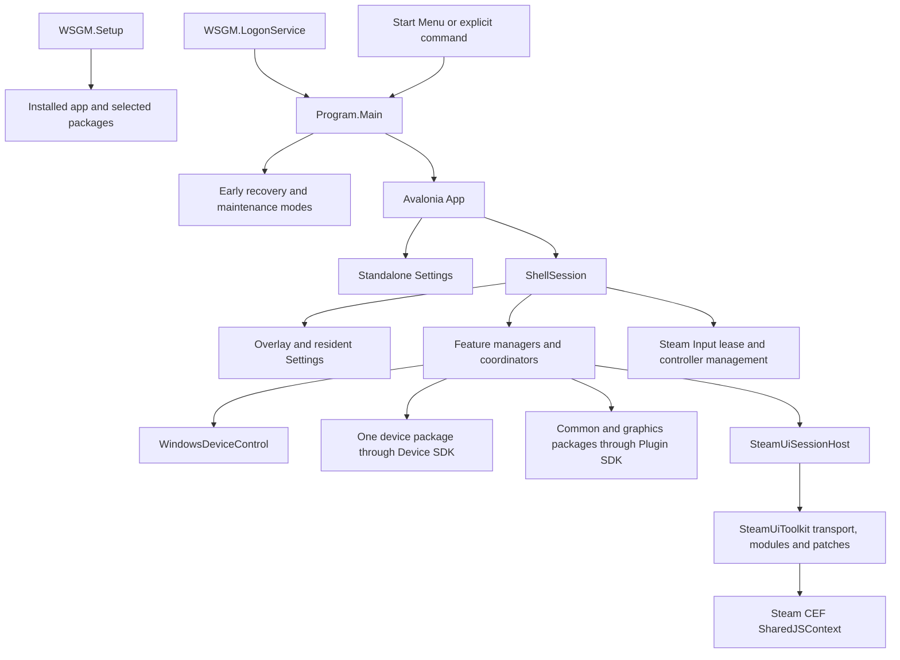

# WSGM from startup to shutdown

This is the route through the running application: which process owns each resource, how a control
reaches Windows or a device, how the same state reaches Avalonia and Steam, and how the session
releases what it owns. The [source map](source-map.md) locates the implementations; the
[development guide](development.md) covers building them. Member-level contracts live in the XML
documentation beside the C# declarations and in the toolkit's TypeScript source.

## Processes and libraries



WSGM is a managed .NET 10 Windows application with an Avalonia UI. It runs device and common plugins
in-process. Package validation, permissions and collectible load contexts are admission and lifetime
mechanisms; they do not sandbox plugin code. The CEF frontend of an admitted plugin also runs with
the Steam document's authority. See [plugin contracts and trust](plugin-system.md).

The executable boundaries have different jobs:

| Process               | Responsibility                                                                                | Contract with the rest of WSGM                                                        |
| --------------------- | --------------------------------------------------------------------------------------------- | ------------------------------------------------------------------------------------- |
| `WSGM.Setup`          | Install, update, repair and uninstall app files, packages and prerequisites                   | Installed layout, setup answers, maintenance commands and update handoff              |
| `WSGM.LogonService`   | Observe sign-in and start the requested user session; recover Explorer after a failed session | The small, untrusted per-user `boot.json` projection; launches using the user's token |
| `WSGM`                | Resident Game/Desktop Mode, Settings, overlay and feature policy                              | Configuration, session-owned services and explicit maintenance modes                  |
| `WSGM.Launch`         | Start an ordinary game with optional de-elevation and a Steam Input lease                     | Parsed wrapper arguments and the lifetime of the launched game                        |
| `WSGM.PackagedLaunch` | Activate or follow an imported game and maintain its selected input/overlay route             | Validated packaged/follow command, runtime classification and game process lifetime   |
| `WSGM.DeviceLab`      | Attended hardware evidence and plugin development                                             | SDK contracts and exported evidence; it is not a resident WSGM service                |

The reusable libraries are project references at pinned submodule commits. SteamUiToolkit owns CDP,
Steam module discovery, the bridge and reversible Steam patches. WindowsDeviceControl owns Windows
audio, radios, displays, brightness and related primitives. WSGM owns their policy and lifetime. The
native Steam Input lease and VIIPER have separate submodules and build pipelines. Device SDK, Plugin
SDK, hardware packages and GPU plugins are ordinary projects in this repository.

## Entry and recovery

[`Program.Main`](../src/WSGM/Program.cs) is deliberately synchronous and marked `[STAThread]`.
[`StartupOptions`](../src/WSGM/StartupOptions.cs) parses the normal mode precedence: `--shell` or
`--boot`, then `--settings`, then `--overlay-test`; no arguments select Settings. Installed
shortcuts provide the intended resident-session arguments. A second resident launch uses activation
signaling and the shell mutex instead of creating another session.

The fixed-purpose Explorer anchor, desktop-shell probe, `--restore-shell` and `--unregister-shell`
run before normal logging and UI construction. Recovery therefore remains available when the user
configuration, log directory or graphics initialization is broken. Later maintenance commands retain
their own explicit place in `MainAsync`; they are not Avalonia windows.

[`App`](../src/WSGM/App.axaml.cs) creates either a standalone Settings window or one rooted
`ShellSession`. The resident session uses explicit application shutdown rather than a main window's
lifetime. Settings activation normally hands a request to that resident session and its existing
input owner. Standalone Settings has no live plugin host.

The logon service starts WSGM as the user, possibly using the linked elevated token. It does not run
the user's executable as SYSTEM, and it does not parse the entire application configuration. Its
watchdog can recover Explorer; it does not repeatedly restart WSGM. The exact boot sequence,
crash-loop breaker and recovery checks are in [boot and shell](boot-and-shell.md) and
[elevation](elevation.md).

## Session composition

[`ShellSession`](../src/WSGM/Shell/ShellSession.cs) starts admission and package work off the UI
thread, then adopts live owners on the Avalonia dispatcher. Startup first attempts any recorded
desktop restoration. It applies pending package removals before loading installed packages, starts
the graphics capability owner and common plugin manager, and admits the optional device runtime.
Partial startup is owned too: a coordinator created after shutdown was requested is shut down rather
than abandoned.

Device Integration off is a complete supported mode. It runs no device-package lifecycle, controller
target, device hardware writes or AutoTDP. Independent shell, overlay, Windows controls, RTSS and
admitted common/GPU plugins can still run. Common packages and the singleton device slot have
separate admission rules; see [device runtime](device-plugin-system.md) and
[common plugins](plugin-system.md).

The session constructs and owns the long-lived managers. A view receives a projection or service
interface and reports user intent. It does not construct a second radio manager, CDP connection,
device runtime or RTSS owner. There are intentional surface lifetimes: `OverlayController` owns
capture/focus and overlay input claims, and a focused Settings window owns its input claim.

Game Mode and Desktop Mode are two postures of this resident session. Desktop Mode is not a stopped
device/plugin runtime. Explorer remains the registered Windows shell; Game Mode asks it to exit
orderly and owns its eventual restoration. `GameModeEntryTransaction` sequences display/audio
preparation, plugin actions, any display wait, Explorer exit and Big Picture entry, with a shared
desktop return path. A pending return record survives a process failure. See
[display and session automation](power-and-display.md#game-mode-display-layouts).

## A control from frontend to backend

The concrete controls differ, but their ownership follows the same route:

1. An Avalonia view reports intent through its owning source/service, or a Steam component sends an
   action through the toolkit bridge.
2. The WSGM owner validates that action against current capability, admission, profile and session
   state. Steam actions also pass the registered vocabulary, generation and replay checks.
3. The owner serializes the effect and invokes the Windows library, device capability router, common
   plugin or other narrow backend.
4. It interprets the returned outcome. An accepted Windows write is not a promise that an immediate
   read will reproduce the requested value. An uncertain device write is not automatically retried.
5. The owner publishes the resulting state to the overlay, Settings or Steam projection. Persistent
   preference goes through the appropriate store; live handles and pending work remain in the owner.

For example, a native Steam brightness control uses a toolkit surface and bridge command, WSGM's
session-owned `NativeQamBrightnessService`, then WindowsDeviceControl. The overlay reaches that same
brightness owner without CDP. Device capability rows instead go through `DeviceCapabilityRouter`;
GPU capabilities have separate routers managed by `GpuCoordinator`.

Profiles add another stage before applying effects: `ProfileService` resolves Global defaults and
per-application overrides, and the session fans the effective values out to their existing owners.
An unset game field inherits Global. Manual changes, reset, AC/battery presets and telemetry have
different persistence rules; [profiles](profiles.md) defines them.

New Big Picture functionality must also be available in the WSGM overlay. Both surfaces use the same
backend, capability rules, state and operations, with their own established controls and navigation.
Keep validation, persistence and side effects in the existing owner instead of reimplementing them
in a second renderer. The
[Steam CEF implementation skill](../.agents/skills/wsgm-steam-cef-toolkit/SKILL.md) routes reusable
toolkit elements, styling and completion checks for both surfaces.

## Steam attachment and frontend code

[`ShellSession.SteamUi.cs`](../src/WSGM/Shell/ShellSession.SteamUi.cs) owns the product gate:

```text
master && !exitPending && ((!inGameMode && !transitionPending) || bigPictureReady)
```

A Big Picture exit hold closes admission before the exit request and remains until desktop return
settles. A reachable debugging endpoint is not Big Picture readiness. Toolkit discovery also
validates the MainWindow target. One process-long transport supplies one attached session; feature
calls borrow it. `SharedJSContext` hosts stores, module discovery, React, the bridge and patches;
the validated MainWindow document is the DOM/screenshot target.

The host registers modules and their command/state contracts. The toolkit probes, applies, verifies
and removes generation-scoped patches. Failed verification removes the partial application. Module
discovery uses source fingerprints and export shapes; numeric webpack IDs and minified export names
are not portable contracts. Steam updates can still invalidate fingerprints or shapes, so a passing
offline build is not evidence of successful attachment to a new client.

The TypeScript frontend is composed from toolkit fragments and WSGM-owned fragments. Its emitted
`NativeQamBootstrap.js` is generated by `eng/build-steam-assets.mjs`; the runtime hashes the
embedded bytes. Edit the owning TypeScript fragment and regenerate, not the emitted JavaScript. The
full transport, bridge, registration, plugin frontend and patch flow is in
[the CEF system guide](steam-cef-system.md), with reusable contracts in the
[toolkit reference](../external/steam-ui-toolkit/docs/reference.md).

For an attended CEF debugging session, first confirm from the current run's Steam logs that Steam
and Big Picture have fully started. Do this before opening a debugger connection or invoking a live
CEF tool. Connecting during startup can hang the entire Steam UI and leave Steam needing to be
force-closed. A reachable endpoint, an old log entry or a window appearing is not enough. This
debugging prerequisite is stricter than the production transport's window-based readiness gate
above; the current runtime does not parse Steam logs for readiness. Follow the delivered
[Steam CEF debugging skill](../.agents/skills/wsgm-steam-cef-debugging/SKILL.md) for the procedure.

## State, threads and shutdown

[`ConfigStore`](../src/WSGM/Core/ConfigStore.cs) owns serialized, fresh-state writer transactions
and atomic publication. Startup may display defaults after an unreadable configuration; mutations
must refuse that state. A reload replaces the configuration object and dispatches it to existing
owners. Do not keep a mutable reference into the previous document. The
[configuration guide](configuration.md) explains reads, migration, recovery copies and boot
projection.

Long-running hardware, file, network and process operations belong in workers or asynchronous
managers. Some startup work, including the boot-manifest read/write in `StartOnUiThread`, remains
synchronous; this boundary is a design rule, not a guarantee that the UI thread performs no I/O.
UI-observable changes return through the dispatcher, with disposal and generation checks immediately
before publication. Cancellation closes admission and stops waiting where supported; it cannot undo
a native write that already began. High-rate controller, sensor and frametime paths avoid per-sample
logging and allocation. Diagnostics record decisions and transitions instead; see
[logging](logging.md).

[`ApplicationRuntime`](../src/WSGM/Core/ApplicationShutdown.cs) and
[`ShellSession.Shutdown`](../src/WSGM/Shell/ShellSession.Shutdown.cs) converge normal exit, update,
uninstall, startup failure and OS session end on one shutdown operation. The sequence first rejects
new work, closes command/profile/import admission, cancels watchers and mode transitions, and
disposes the overlay. It joins startup and in-flight owners before tearing down their dependencies,
releases controller/HidHide ownership, stops integrations and restores desktop state where the exit
reason requires it. Individual cleanup failures are collected so they cannot skip later cleanup. An
OS session end prevents a competing Explorer restart. This is ordered restoration of WSGM's own
changes, not a promise that an unavailable device or Windows call can always be reversed.

`ApplicationShutdownCoordinator.BudgetFor` allows 15 seconds for normal exit or startup failure, 10
for an update, 20 for uninstall and 5 for OS session end. A later session-end request can tighten
the existing deadline. The outcome contract distinguishes `Clean`, `Unverified`, `TimedOut` and
`Failed`; a timeout does not prove all native work stopped, and late completion is still observed.

For the exact paths and deeper contracts, continue with the [source map](source-map.md),
[documentation index](README.md) and
[How it Works wiki](https://github.com/KillerPixelCrew/WSGM/wiki/How-it-Works).
